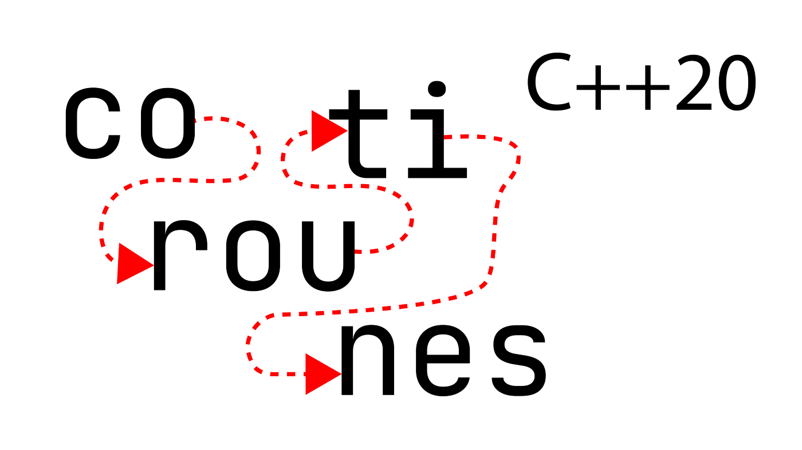

# Coroutinen

[Zurück](../../Readme.md)

---

(Quelle: [Blog von Simon Tóth](https://itnext.io/c-20-coroutines-complete-guide-7c3fc08db89d))

---

## [Einführung](Readme_01_Introduction.md)

## [Erste Schritte](Readme_02_FirstSteps.md)

## [ `co_return` und `co_yield`](Readme_03_Yield_Return.md)

## [`co_await`](Readme_04_Awaiter_Awaitable.md)

## [Coroutine Iteratoren](Readme_05_Iterators.md)

## [Literatur](Literature.md)

---

[Zurück](../../Readme.md)

---

