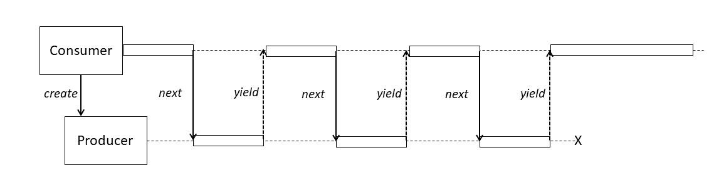

# Einführung

[Zurück](Readme.md)

---

[Quellcode](Coroutines_01_Introduction.cpp)

---

Ganz kurz und prägant:

> Eine Coroutine ist eine Funktion, die sich selbst suspendieren kann.

---

## Motivation

Zur Motivation von Coroutinen betrachten wir eine Funktion `getNumbers`:

```cpp
std::vector<int> getNumbers(int begin, int end)
{
    std::vector<int> numbers;
    
    for (int i = begin; i <= end; ++i) {
        numbers.push_back(i);
    }

    return numbers;
}
```

Folgende Beobachtungen sind wichtig:

  * Ein Aufrufer von `getNumbers` bekommt immer alle Werte, die er durch die beiden Parameter 
    `begin` und `end` anfordert. Dies wirkt sich negativ bei vielen Zahlen auf den benötigten Speicherplatz aus.

  * Darüberhinaus kann es sein, dass ein Aufrufer nach dem Auswerten der ersten 5 Zahlen
    möglicherweise an den restlichen Zahlen überhaupt nicht mehr interessiert ist.
    Bei einem Wert `end` gleich 1000 wurden also fast alle angeforderten Werte umsonst berechnet und transportiert.

Man spicht in der Informatik bei derartigen Berechnungen immer in der Vorgehensweise &ldquo;greedy&rdquo; oder &ldquo;lazy&rdquo;.
Die Funktion `getNumbers` fällt offensichtlich in die erste Kategorie.
Mit Hilfe von Coroutinen könnten Sie eine Variation von  `getNumbers ` auf Basis der &ldquo;lazy&rdquo;-Strategie
umsetzen.

```cpp
Generator generatorForNumbers(int begin, int end)
{
    for (int i = begin; i <= end; ++i) {
        co_yield i;
    }
}
```

Eine Anwendung könnte nun so aussehen:

```cpp
Generator coroutine = generatorForNumbers(1, 10);

while (true) {

    int value = coroutine.next();
    if (value == -1) {
        break;
    }
}
```

Diese beiden Code-Fragmente sind nicht unmittelbar übersetzungsfähig.
Wir nehmen sie als Ausgangspunkt unserer Betrachtungen der ersten Schritte im
Umfeld von C++&ndash;Coroutinen.

---

## Etwas Theorie

*Erforderliche Begriffe*:

  * *Kooperatives Multitasking* (auch als *nicht-präemptives Multitasking* bezeichnet) &ndash;
    Man spricht von *kooperativem Multitasking* wenn die beteiligten Prozesse (Threads)
    freiwillig die Kontrolle regelmäßig abgeben.
    Diese Art des Multitaskings erfordert zwingend, dass sich alle Teilnehmer an diese Regel halten!

  * *Präemptives Multitasking* &ndash; Das Gegenteil von *kooperativem Multitasking* ist das so genannte *präemptive Multitasking*.
    *Präemptives Multitasking* wird durch das Betriebssystem verwaltet bzw. organisiert. Ein *Scheduler* (oder auch als *Dispatcher* bezeichnet)
    bestimmt, wie lange ein Prozess (Thread) laufen darf. Ist die Zeit abgelaufen (Zeitscheibe), wird ein Kontextwechsel
    durchgeführt, also ein anderer Prozess (Thread) ausgewählt.

  * Unterprogramm &ndash; Anderer Begriff für eine &ldquo;reguläre&rdquo; Funktion (auch als *Prozedur* bezeichnet).

*Kurz und bündig*:

Coroutinen sind Funktionen, die das kooperative Multitasking ermöglichen, indem wiederholt die Ausführung angehalten und fortgesetzt werden kann.
Coroutinen unterbrechen die Ausführung, indem sie immer wieder zum Aufrufer zurückkehren und dabei auch Daten zurückliefern.
Daten, die zur Wiederaufnahme der Ausführung erforderlich sind, werden getrennt von einem Stapel gespeichert.

Coroutinen eigen sich zur Implementierung von sequentiellem Code, der asynchron ausgeführt wird
(z. B. um nicht blockierende E / A ohne explizite Rückrufe zu verarbeiten) und unterstützt auch Algorithmen für verzögert berechnete unendliche Sequenzen und andere Verwendungen.


*Abbildung* 1: Subroutines (links) und Coroutines (rechts) im Vergleich.

*Man beachte*: 
Nicht zwingend müssen Aufrufer der Coroutine und die Coroutine selbst in verschiedenen Threads ablaufen:
Coroutinen (und ihr Aufrufer) können sehr wohl auf einem einzigen Thread ausgeführt werden.
Siehe dazu *Abbildung* 2, die bewusst keine Aussagen über Threadaffinitäten trifft:



*Abbildung* 2: Kontrollfluss zwischen einem Produzenten (Coroutine) und einem Konsumenten (Anwendung).

---

## Coroutinen: *stackless* und *stackful*

Coroutinen existieren in den verschiedenene Programmierumgebungen prinzipiell
in zwei Ausprägungen:

  * *stackless*
  * *stackful*

*Stackful* Coroutinen haben einen separaten Stack (ähnlich einem Thread), der den
so genannten *Coroutine-Frame* und die verschachtelten Aufruf-Frames enthält.
Dadurch ist es möglich, an einer beliebigen Stelle im verschachtelten Aufruf-Frame
zu unterbrechen (*suspend*) und wieder fortzufahren (*resume*).

*Stackless* Coroutinen müssen den Coroutine-Frame an einer anderen Stelle speichern
(normalerweise auf dem Heap) und verwenden den Stapel des *aktuell* ausgeführten Threads,
um verschachtelte Aufrufe durchführen zu können.


*Abbildung* 1: Funktionen versus Coroutinen &ndash; *stackless* versus *stackful* Coroutinen.

In C++ 20 finden wir eine Unterstützung für *stackless* Coroutinen vor.

---

## &ldquo;Don't implement coroutines yourself&rdquo;

Um es deutlich zu sagen: Der Standard C++ 20 enthält *keine* Coroutinen.
Er definiert statt dessen einen *Framework* für Coroutinen, mit dessen Hilfe sich Coroutinen implementieren lassen,
siehe hierzu das nachfolgende Beispiel einer Generatorklasse.

*Tipp*: In einer zukünftigen Version (C++ 20, C++ 23) wird es eine umfangreichere Unterstützung / exemplarische Realisierung
dieses Frameworks geben, so dass eine Entwicklung von Coroutinen für den Anwender einfacher ausfällt.

---

## Coroutinen in C++ 20

Per Definition wird in C++ 20 eine Funktion als *Coroutine* bezeichnet, wenn

  * sie das Schlüsselwort `co_yield` verwendet , um die Ausführung anzuhalten und einen Wert zurückzugeben.
  * sie das Schlüsselwort `co_return` verwendet , um die Ausführung abzuschließen.
  * sie den Operator `co_await` verwendet (*suspend*), um die Ausführung bis zur Wiederaufnahme (*resume*) zu unterbrechen.

---

## Ein Generator Template: `Generator<T>`

*Definition*:

Ein *Generator* stellt einen Datentyp für eine Coroutine dar, die eine Folge von Werten des Typs `T` erzeugt,
wobei die Werte *on-demand* (*lazy*) und synchron (im Kontext der Coroutine) erzeugt werden.


## Ein Beispiel für Fibonacci-Zahlen

*Beispiel*:

```cpp
Generator<long long> fibonacci() {
    long long a = 0;
    long long b = 1;
    while (true) {
        co_yield b;
        auto tmp = a;
        a = b;
        b += tmp;
    }
}
```

*Anwendung*:

Man beachte bei diesem Beispiel, dass es sich bei der Generator-Funktion um einen so genannten *unendlichen* Generator
handelt. Es obliegt folglich der Anwendung, für einen kontrollierten Abbruch zu sorgen. 
Natürlich könnte man einen Generator auch so implementieren, dass es nur endlich viele Werte erzeugt.

```cpp
for (auto i : fibonacci()) {
    if (i > 1'000'000)
        break;

    std::cout << i << std::endl;
}
```

*Ausgabe*:

```
1
1
2
3
5
8
13
21
34
55
89
144
233
377
610
987
1597
2584
4181
6765
10946
17711
28657
46368
75025
121393
196418
317811
514229
832040
```

## Literaturhinweise:

Die Anregungen zu den Beispielen stammen teilweise bzw. in modifizierter Form aus
[C++20: Coroutinen mit cppcoro](https://www.heise.de/developer/artikel/C-20-Coroutinen-mit-cppcoro-4705161.html)
von Rainer Grimm.

---

[Zurück](Readme.md)

---
