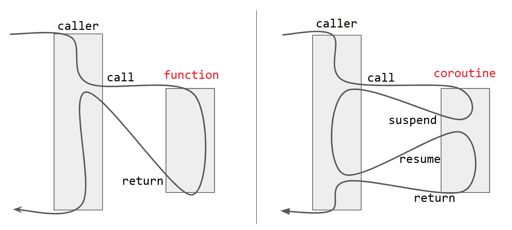

# Erste Schritte

[Zurück](Readme.md)

---

[Quellcode](Coroutines_02_FirstSteps.cpp)

---

## Drei neue Schlüsselwörter

Eine C++&ndash;Funktion erlangt den Status einer Coroutine, wenn sie eines der
drei neuen C++&ndash;Schlüsselwörter verwendet:

  * `co_return`
  * `co_yield`
  * `co_await`

Diese recht einfache Aussage lässt sich etwas präzisieren:

Eine Funktion ist eine Coroutine, wenn ihre Definition eine der folgenden Aktionen ausführt:

  1. verwendet den `co_await` Operator, um die Ausführung der Funktion zu unterbrechen (*suspend*) ...
  2. verwendet das Schlüsselwort `co_yield`, um die Ausführung der Funktion zu unterbrechen (*suspend*) und um einen Wert zurückgeben ...
  3. verwendet das Schlüsselwort `co_return`, um die Ausführung abzuschließen und um einen Wert zurückzugeben ...


## Vorab: Eine Coroutine ist keine C-Funktion

Wollten wir eines der Coroutinen-Schlüsselwörter im Kontext einer &ldquo;normalen&rdquo; C/C++&ndash;Funktion
verwenden, erhalten wir ein nicht übersetzungsfähiges C++-Programm:

<pre>
int foo() { co_return 2; }
</pre>

Wir erhalten je nach verwendetem Compiler folgende Fehlermeldung:

  * Visual C++: `'promise_type': is not a member of 'std::coroutine_traits<int>'`
  * gcc: `In function 'int foo()': error: unable to find the promise type for this coroutine`


## Ein erstes Beispiel

Das folgende Code-Fragment &ndash; noch nicht übersetzungsfähig &ndash; beschreibt eine Coroutine:

```cpp
#include <coroutine>

Generator coroutine(int n)
{
    co_yield "Hello";
    co_yield "World";
    co_return;
}
```

Man könnte zu der Formulierung neigen, dass `coroutine` die Definition einer Funktion ist.
Präziser müssen wir sagen: Wir verwenden die Syntax einer Funktionsdefinition,
um einen Codeblock zu beschreiben, dem bei der Instanziierung Argumente übergeben werden können
(hier exemplarisch der Parameter `n`)

Zum zweiten erkennen wir, dass ein Rückgabetyp &ndash; hier der exemplarische Typ `Generator` &ndash;
in Erscheinung tritt, und das, obwohl `coroutine()` keine `return`-Anweisung enthält &ndash; 
und per Definition auch nicht enthalten kann.



*Abbildung* 2: Coroutinen können sich suspendieren.

Der Compiler ordnet diesen Codeblock neu an, um den Coroutinen-Mechanismus mit seinem
*Save*- und *Restore*-Anweisungen auszurollen. Diese werden unter anderem durch 
die beiden Schlüsselwörter `co_yield` und `co_return` beeinflusst.
Grob könnte man dieses Umordnen vom Übersetzer so skizzieren:

<pre>
Generator coroutine() {

    __Generator_ctx* <b>__context</b> = new __Generator_ctx{};

    auto __return = <b>__context</b> -> <b>_promise</b>.get_return_object();

    co_await <b>__context</b> -> <b>_promise</b>.initial_suspend();

    co_yield "Hello";
    co_yield "World";

__final_suspend_label:

    co_await <b>__context</b> -> <b>_promise</b>.final_suspend();

    delete <b>__context</b>;

    return __return;
}
</pre>

Ein Anwendungsprogramm (ebenfalls noch nicht übersetzungsfähig),
dass diese Coroutine verwenden will, könnte so aussehen:

```cpp
Generator client = coroutine();

std::cout << client.next();
std::cout << client.next();
```

Sobald wir alle zwei via `co_yield` verfügbaren Werte verbraucht haben,
wird die Coroutine beendet und der gesamte Speicher freigegeben,
der zum Speichern des Coroutinen-Zustands verwendet wurde.

Das Zusammenspiel zwischen `co_yield` (Coroutine / Produzent) und `next` (Anwendung / Konsument)
kann exakter so beschrieben werden:

1. den aktuellen Client-Code suspendieren (Konsument)
2. den Zustand der Coroutine wiederherstellen (Produzent)
3. den Coroutinen-Code ab der letzten `co_yield`-Anweisung fortsetzen
4. speichern des Werts der nächsten `co_yield`-Anweisung
5. den Coroutinen-Zustand abspeichern (Produzent)
6. den Zustand des Client-Codes wiederherstellen (Konsument)
7. den Client-Code fortsetzen, indem diesem der gespeicherte Wert aus der `co_yield`-Anweisung zugeführt wird


## Der C++ *Coroutine Framework* 

### Ein *Generator*

Um im C++&ndash;Laufzeitsystem eine Coroutine zu verwalten, bedarf es eines so genannten
*Generator*-Objekts, das den Lebenszyklus einer Coroutine abbildet und verwaltet.

Informationen dieser Klasse sind in der `include`-Datei

```cpp
#include <coroutine>
```

vorhanden. Man könnte geneigt sein zu vermuten, dass in dieser Include-Datei eine Schnittstelle
oder eine abstrakte Klassendefinition für das *Generator*-Objekt abgelegt sind.
In C++ 20 gibt es hierfür
`concepts`, die entsprechende Forderungen (`requires`) an eine Implementierung stellen.
Es müssen je nach Anwendungsfall eine Reihe von Methoden eines bestimmten Namens
und mit bestimmten Parametertypen definiert sein.

Jede C++&ndash;Anwenderklasse, die den Anspruch erhebt, eine *Generator*-Klasse zu sein,
muss einen Bezug zu einer vordefinerten Klasse eines bestimmten Namens aufweisen:

```cpp
struct promise_type
```

Genau betrachtet erzwingen C++20 Coroutinen,
dass wir zwei miteinander verbundene, unterstützende Klassen bereitstellen:

  * eine Klasse zum Speichern des Coroutinen-Zustands und zum Speichern der Daten, die via `co_yield` bereit gestellt werden.
    Diese Klasse wird in der Regel als *Promise* bezeichnet, daher auch der Typbezeichner `promise_type`.
  * eine Klasse zur Verwaltung des Coroutinen-(Promise-)Objekts &ndash; das ist die *Generator*-Klasse.

Im *Promise*-Objekt sind die Lebenszyklusmethoden einer Coroutine bereitzustellen.


### Das *Promise*-Objekt

Wir führen zwei Methoden des *Promise*-Objekts exemplarisch auf:

Verwendet eine Coroutine eine `co_yield`-Anweisung mit einem `std::string`-Wert,
benötigen wir im *Promise*-Objekt eine Methode mit der folgenden Signatur:

```cpp
std::suspend_always yield_value(std::string value);

```

Der Parameter ist gewissermaßen das Objekt, welches das Argument von `co_yield` darstellt.
Der Rückgabewert von `yield_value` teilt dem Laufzeitsystem mit, 
ob der Thread-Status gespeichert werden soll.

Die `yield_value`-Methode muss ihr Argument speichern,
damit es bei Anforderung den Wert an die aufrufende Routine (Consumer)
zurückgeben kann:

```cpp
std::suspend_always yield_value(std::string value) {
    m_value = std::move(value);
    return {};
}
```

Die `return`-Anweisung entspricht &ldquo;Modern C++&rdquo;:
`return {}` bedeutet einfach, ein Objekt des Rückgabetyps (Standard-Konstruktor)
für diese Methode zu erstellen. Man könnte auch

```cpp
return std::suspend_always{}
```

schreiben.

---

### Beispielquellcode: Das *Promise*-Objekt

```cpp
01: struct Promise
02: {
03:     using value_type = std::string;
04: 
05:     std::string m_value{};
06: 
07:     Promise() = default;
08: 
09:     std::suspend_always initial_suspend() { return {}; }
10: 
11:     std::suspend_always final_suspend() noexcept { return {}; }
12: 
13:     void unhandled_exception() { std::rethrow_exception(std::current_exception()); }
14: 
15:     std::suspend_always yield_value(std::string value) {
16:         m_value = std::move(value);
17:         return {};
18:     }
19: 
20:     void return_void() {
21:         m_value.clear();
22:     }
23: 
24:     Generator get_return_object();
25: };
```

### Beispielquellcode: Der Generator

```cpp
01: class Generator
02: {
03: public:
04:     using promise_type = Promise;
05: 
06:     explicit Generator(std::coroutine_handle<Promise> handle)
07:         : m_handle(handle)
08:     {}
09: 
10:     ~Generator() {
11:         if (m_handle) { m_handle.destroy(); }
12:     }
13: 
14:     Promise::value_type next() {
15:         if (m_handle) {
16:             m_handle.resume();
17:             return m_handle.promise().m_value;
18:         }
19:         else {
20:             return {};
21:         }
22:     }
23: 
24: private:
25:     std::coroutine_handle<Promise> m_handle{};
26: };
27: 
28: Generator Promise::get_return_object()
29: {
30:     return Generator{ std::coroutine_handle<Promise>::from_promise(*this) };
31: }
```

### Beispielquellcode: Die Coroutine

```cpp
01: // coroutine
02: Generator generator()
03: {
04:     co_yield std::string{ "Hello " };
05:     co_yield std::string{ "World" };
06:     co_return;
07: }
```

### Beispielquellcode: Der Konsument

```cpp
01: void test()
02: {
03:     auto coroutine = generator();
04: 
05:     std::cout << coroutine.next() << std::endl;
06:     std::cout << coroutine.next() << std::endl;
07:     std::cout << std::endl;
08: }
```

## Übung:

Wie müssen Sie den Quellcode für den &ldquo;Hello World&rdquo;-Generator umschreiben,
um die in der Einleitung skizzierte Idee eines &ldquo;Lazy&rdquo;-Generators für
aufsteigende, ganze Zahlen zu implementieren?


## Literaturhinweise:

Die Anregungen zu den Beispielen stammen zum großen Teil aus dem Artikel
&ldquo;[C++20 Coroutines](https://blog.feabhas.com/2021/09/c20-coroutines/#Promise_data_holder)&rdquo;
von Martin Bond.

---

[Zurück](Readme.md)

---
