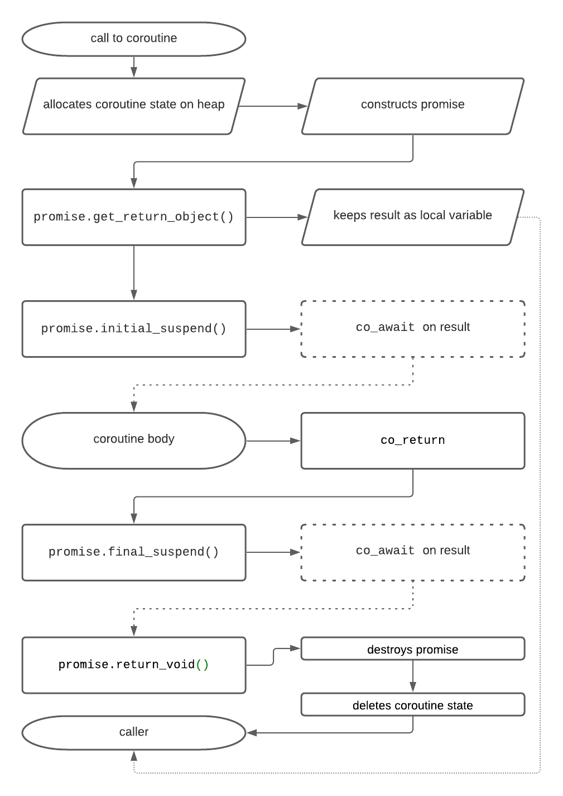

# `co_return` und `co_yield`

[Zurück](Readme.md)

---

[Quellcode](Coroutines_03_Yield_Return.cpp)

---

Im Prinzip werden C++ Coroutinen durch einen so genannten *Coroutinen Framework* gebildet,
der ergänzend zum Quellcode des Anwenders durch den Compiler hinzugefügt wird.

Die konkrete Gestaltung dieses generierten Codes hängt von
benutzerdefinierten Rückgabetypen und von einem *Promise*-Datentyp ab.

Bis auf Weiteres &ndash; das könnten Spracherweiterungen von C++&ndash;23 sein  &ndash; 
müssen wir diesen oftmals als &ldquo;Boilerplatecode&rdquo; bezeichneten Quellcode selber schreiben.

Ohne ein Verständnis dieses &ldquo;Boilerplatecode&rdquo; Quellcodes geht es also nicht,
wir nähern uns dem *Coroutinen Framework* in langsamen Schritten.

## Eine Coroutine, die nichts tut

Werfen wir einen Blick auf die kürzestmögliche Coroutine,
die wir zum jetzigen Zeitpunkt (C++ Sprachstandard Version C++&ndash;20 &ndash; Dezember 2020)
schreiben können:

<pre>
01: struct Generator {
02: 
03:     struct promise_type {
04:         Generator get_return_object() { return {}; }
05:         std::suspend_never initial_suspend() { return {}; }
06:         std::suspend_never final_suspend() noexcept { return {}; }
07:         void return_void() { }
08:         void unhandled_exception() { }
09:     };
10: };
11: 
12: Generator myCoroutine() {
13:     co_return; // make it a coroutine
14: }
15: 
16: void main()
17: {
18:     Generator x = myCoroutine();
19: }
</pre>

So sieht eine minimalistische Coroutine aus,
die sofort zurückkehrt und nichts tut.

Sie ist aber ein ausgezeichneter Ausgangspunkt,
um sich den vom Compiler generierten Framework-Code anzusehen:

*Abbildung* 1: Diagramm, das den Umfang des *Coroutinen Framework* Codes zeigt, der vom Compiler um die Coroutine herum generiert wird.

Neben den Erläuterungen von *Abbildung* 1 sehen wir uns das minimalistische Coroutinenbeispiel
mit instrumentierten Testausgaben an.
Die Ausgabe sieht so aus:

<pre>
before coroutine call
  c'tor promise
  get_return_object
c'tor Generator
  initial_suspend
inside coroutine
  return_void
  final_suspend
  ~promise
after coroutine call
~Generator
</pre>

Wir erkennen:

> Bevor der Konstruktor von `Generator` zur Ausführung gelangt, wurde bereits eine Instanz
von der inneren Klasse `struct promise_type` angelegt!

## `std::suspend_never` versus `std::suspend_always`

Was ist das Problem bei der zuletzt demonstrierten Coroutine?
Wir zeigen dies an zwei Änderungen am Quellcode auf:
Was würde passieren, wenn wir den Rückgabetyp von `initial_suspend()` in `std::suspend_always`
(an Stelle von `std::suspend_never`) umändern?

<pre>
std::suspend_never initial_suspend() { return {}; }
</pre>

Wir erkennen das Problem an der abgewandelten Ausgabe des Programms:

<pre>
before coroutine call
  c'tor promise
  get_return_object
c'tor Generator
  initial_suspend
after coroutine call
~Generator
</pre>

Der Destruktor des *Promise*-Objekts wird nicht ausgeführt! Es enstehen somit Leaks in der Speicherverwaltung,
wovon wir uns &ndash; in der Visual Studio Umgebung &ndash; auch überzeugen können:

<pre>
Detected memory leaks!
Dumping objects ->
{154} normal block at 0x00924838, 56 bytes long.
 Data: <` d @~d         > 60 89 64 00 40 7E 64 00 CD 00 CD CD 02 00 01 00 
Object dump complete.
</pre>

Was ist eigentlich das Problem? Der C++ *Coroutinen Framework* generiert für unsere Coroutine ein
*Promise*-Objekt, auf das wir zum jetzigen Zeitpunkt keinerlei Zugriffsmöglichkeit haben!

Wenn wir den Rückgabetyp der `initial_suspend`-Methode von `std::suspend_never` in `std::suspend_always` abändern,
hat dies zur Folge, das ein Aufruf von `co_await` am *Promise*-Objekt zu einer Suspendierung
der Coroutine führt (*suspend*). Dies wird ja durch die entsprechenden Namensgebungen der beteiligten
Methoden/Objekte auch nahegelegt.

Damit landet die Kontrolle der Ausführung wieder beim Anwender &ndash; der aber keinerlei Möglichkeit hat,
das *Promise*-Objekt zur Weiterarbeit zu bewegen (*resume*).

Es ist möglich, das so genannte *coroutine_handle* dem Anwender zur Verfügung zu stellen,
wie der nächste Abschnitt zeigt.

## `std::coroutine_handle<promise_type>`

Betrachten Sie die in fett gesetzten Änderungen am Beispielquellcode:

<pre>
01: struct Generator {
02: 
03:     struct promise_type {
04: 
<b>05:         using Handle = std::coroutine_handle<promise_type>;
06: 
07:         Generator get_return_object() {
08:             return Generator{Handle::from_promise(*this)};
09:         }</b>
10: 
11:         std::suspend_always initial_suspend() { return {}; }
12:         std::suspend_never final_suspend() noexcept { return {}; }
13:         void return_void() { }
14:         void unhandled_exception() { }
15:     };
16: 
<b>17:     explicit Generator(promise_type::Handle coro) : m_coro(coro) {}
18:     void destroy() { m_coro.destroy(); }
19:     void resume() { m_coro.resume(); }
20: 
21: private:
22:     promise_type::Handle m_coro;</b>
23: };
24: 
25: Generator myCoroutine() {
26:     co_return; // make it a coroutine
27: }
28: 
29: void main() {
30:     auto c = myCoroutine();
31:     c.resume();
32:     // c.destroy();
33: }
</pre>

Studieren Sie folgende Aussagen genau:

  * Zeilen 7 bis 9 &ndash; Der `get_return_object` kreiert ein `Generator`-Objekt (Anwender-Objekt),
    diesem wird durch den Konstruktor (Zeile 17) mit `*this` eine Referenz des *Promise*-Objekts übergeben.
  * Zeile 5  &ndash; Für den (indirekten) Zugriff auf ein *Promise*-Objekt gibt es einen vordefinerten Datentyp `std::coroutine_handle<promise_type>`.
  * Zeile 22  &ndash; Für das *Promise*-Objekt besitzt die Anwenderklasse nun eine (private) Instanzvariable: `m_coro` vom Typ `promise_type::Handle`.
  * Zeilen 18 oder 19 &ndash; Methoden wie `resume` oder `destroy`, die das Anwenderobjekt `Generator` definiert,
    sind nun in der Lage, über die (private) Instanzvariable `m_coro` auf das verborgene *Promise*-Objekt zuzugreifen.

*Hinweis*:
Das `Generator`-Objekt besitzt ein *Promise*-Objekt. Dieses ist am Heap allokiert (&ldquo;*stackless*&rdquo; Coroutinenkonzept).
Damit könnte es zu Problemen beim Kopieren eines Coroutinen-Anwenderobjekts kommen.
Das Kopieren eines Coroutinen-Objekts ist kein abwegiger Gedanke, da dieses im Regelfall Anwenderdaten besitzt (berechnet, verwaltet ...)
und damit auch kopiert werden können sollte. Die Frage ist nur, mit welchem Verhalten (*Behaviour*): *Copy-Semantics* oder *Move-Semantics*?
Sie sind auf der sicheren Seite, wenn Sie sich für das Verhalten *move-only* entscheiden.
Betrachten Sie damit die folgende exemplarische Implementierung:

<pre>
01: Generator(const Generator&) = delete;
02: Generator& operator=(const Generator&) = delete;
03: 
04: Generator(Generator&& t) noexcept : m_coro(t.m_coro) { t.m_coro = {}; }
05:         
06: Generator& operator=(Generator&& t) noexcept {
07:     if (this == &t) {
08:         return *this;
09:     }
10:     if (m_coro) {
11:         m_coro.destroy();
12:     }
13:     m_coro = t.m_coro;
14:     t.m_coro = {};
15:     return *this;
16: }
</pre>

Wir wenden uns nun einer Coroutine zu, die eine minimalistische Funktionalität aufweist,
also gewissermaßen geringfügig mehr als &ldquo;nichts&ldquo; tut.
Damit sind wir beim Konzept des *Generators* angekommen:

## Eine Coroutine mit Generator

Wollen wir eine Coroutine betrachten, die eine Funktionalität besitzt, also in der Lage ist,
Daten zu produzieren, diese bereitzustellen und weitere Daten zu berechnen,
benötigen wir das Schlüsselwort `co_yield`.

Mit `co_yield`  sind wir in der Lage, eine Funktion zu schreiben, die sich suspendieren kann!

Statten wir `co_yield` mit einem Argument aus, also etwa `co_yield value`, dann stellt diese Schreibweise 
eine Kurzformulierung für

<pre>
co_await promise.yield_value(value);
</pre>

dar. Das *Promise*-Objekt steuert jetzt, was es bedeutet, einen Wert zurückzugeben und ob/wie die Coroutine ausgesetzt wird.
Hier verwenden wir `std::suspend_always`, da wir die Coroutine bis zum nächsten Aufruf von `get_next()` stoppen wollen.
Hierzu ein Beispiel:

<pre>
01: struct Generator {
02: 
03:     struct promise_type {
04: 
05:         using Handle = std::coroutine_handle<promise_type>;
06: 
07:         Generator get_return_object() {
08:             return Generator{ Handle::from_promise(*this) };
09:         }
10: 
11:         std::suspend_always initial_suspend() { return {}; }
12:         std::suspend_always final_suspend() noexcept { return {}; }
13: 
14:         std::suspend_always yield_value(int value) {
15:             current_value = value;
16:             return {};
17:         }
18: 
19:         void return_void() {}
20: 
21:         void unhandled_exception() { }
22: 
23:         int current_value;
24:     };
25: 
26:     explicit Generator(promise_type::Handle coro) : m_coro{ coro } {}
27: 
28:     ~Generator() {
29:         if (m_coro) m_coro.destroy();
30:     }
31: 
32:     int get_next() {
33:         m_coro.resume();
34:         return m_coro.promise().current_value;
35:     }
36: 
37: private:
38:     promise_type::Handle m_coro;
39: };
40: 
41: Generator myCoroutine() {
42:     int x = 0;
43:     while (true) {
44:         co_yield x++;
45:     }
46: }
47: 
48: void test_04()
49: {
50:     Generator c = myCoroutine();
51:     int x = 0;
52:     while ((x = c.get_next()) < 10) {
53:         std::cout << x << std::endl;
54:     }
55: }
</pre>

Wenn wir den Code instrumentieren, erhalten wir folgende Ausgaben:

<pre>
  c'tor promise
  get_return_object
c'tor Generator
  suspend_always
get_next
  yield_value
0
get_next
  yield_value
1
get_next
  yield_value
2
get_next
  yield_value
~Generator
  ~promise
Done.
</pre>

---

## Terminologie

### *Promise*

  * Ein Typ, der präzise den Namen `promise_type` haben muss.
  * Das *Promise*-Objekt wird innerhalb der Coroutine verwendet. Die Coroutine übermittelt ihr Ergebnis (oder Exceptions) durch dieses Objekt.
  * Der *Promise*-Typ wird vom Compiler aus dem Rückgabetyp der Coroutine mit `std::coroutine_traits` ermittelt.

### Coroutine Handle (`std::coroutine_handle<promise_type>`)
 
  * Das Coroutine-Handle wird verwendet, um die Ausführung der Coroutine fortzusetzen oder
    um den (dynamisch allokierten) *Coroutine Frame* wieder freizugeben.
    Über `std::coroutine_handle::done()` erhält man Statusinformationen zur Coroutine.

### Coroutine Zustand

  *  Der Zustand einer Coroutine (manchmal auch als Kontext-Objekt bezeichnet) ist ein vom Compiler generiertes,
     auf dem Heap allokiertes Objekt, das
     * das Promise-Objekt,
     * Parameter (per-value) und
     * eine Representation des aktuellen &ldquo;Suspendierungspunkts&rdquo; (so genannter &ldquo;Suspension Point&rdquo;) beschreibt,
       so dass eine Aktivität *resume* weiß, wo sie fortfahren muss.

---

## Literaturhinweise

Die Anregungen zu den Beispielen stammen zum großen Teil aus dem Artikel

&ldquo;[C++20 Coroutines &ndash; Complete Guide](https://itnext.io/c-20-coroutines-complete-guide-7c3fc08db89d)&rdquo;
von Simon Tóth.

Die Beschreibungen zur Terminologie stammen aus
[C++20 Coroutine: Under The Hood](https://vishalchovatiya.com/posts/cpp20-coroutine-under-the-hood/).

---

[Zurück](Readme.md)

---
