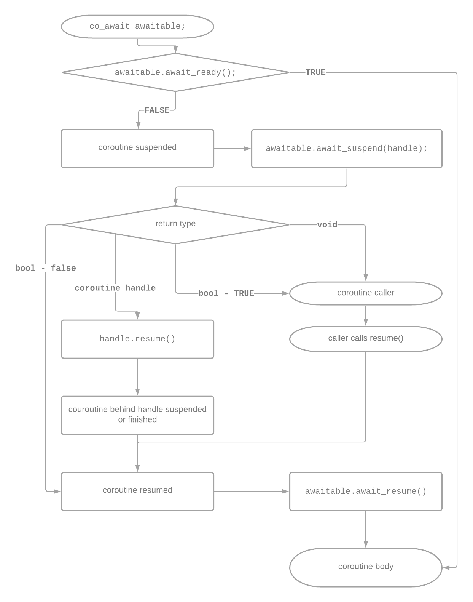

# `co_await`

[Zurück](Readme.md)

---

[Quellcode](Coroutines_04_Awaiter_Awaitable.cpp)

---

## Eine Coroutine, die auf nichts wartet

Auch der Gebrauch des Schlüsselworts `co_await` will gelernt sein &ndash; im Syntaxjargon von C++ haben wir es hier mit
einem C++&ndash;Operator zu tun. Wir beginnen mit einem einfachen Beispiel einer Coroutine,
die auf nichts wartet:

<pre>
01: struct Generator {
02:     struct promise_type {
03:         promise_type() = default;
04:         Generator get_return_object() { return {}; }
05:         std::suspend_never initial_suspend() { return {}; }
06:         std::suspend_never final_suspend() noexcept { return {}; }
07:         void return_void() { }
08:         void unhandled_exception() {}
09:     };
10: };
11: 
12: Generator myCoroutine() {
13:     std::cout << "before coroutine" << std::endl;
14:     co_await std::suspend_never{};
15:     std::cout << "after coroutine" << std::endl;;
16: }
17: 
18: void test_01() {
19:     myCoroutine();
20: }
</pre>

*Ausgabe*:

<pre>
before coroutine
after coroutine
Done.
</pre>


Prinzipiell muss der `co_await` Operator einen Operanden haben, der als *Awaitable* definiert ist.

Bevor auf eine allgemeingültige Definition eines *Awaitable* Ausdrucks eingehen, rufen wir in Erinnerung,
dass wir zwei *Awaitable* Objekte bereits kennen gelernt haben:

  * `std::suspend_always` &ndash; weist `co_await` an, die Coroutine zu unterbrechen
  * `std::suspend_never` &ndash; weist `co_await` an, die Coroutine nicht zu suspendieren. 

Damit sind

<pre>
co_await std::suspend_always{};
</pre>

und

<pre>
co_await std::suspend_never{}; 
</pre>

korrekte Beispiele für Coroutinen mit `co_await`.

*Hinweis*: Um ein besseres Verständnis für die Funktionsweise von `co_await` zu bekommen,
haben Sie in dem letzten Listing drei Möglichkeiten, die Ausführung des Beispiels zu beeinflussen:

  * Zeile 5 &ndash; Wechsel zwischen `std::suspend_always` und `std::suspend_never`.
  * Zeile 6 &ndash; Wechsel zwischen `std::suspend_always` und `std::suspend_never`.
  * Zeile 14 &ndash; Wechsel zwischen `std::suspend_always` und `std::suspend_never`.

---

## Definition eines Awaitables

Ein *Awaitable*-Datentyp muss drei Methoden bereitstellen: 

```cpp
struct awaitable {
    bool await_ready();
   
    // one of:
    void await_suspend(std::coroutine_handle<>) {}
    bool await_suspend(std::coroutine_handle<>) {}
    std::coroutine_handle<> await_suspend(std::coroutine_handle<>) {}

    void await_resume() {}
};
```

Wenn ein *Awaitable*-Datentyp Ziel eines `co_await`-Aufrufs ist,
wird der Operator `co_await` ausgeführt und das *Awaiter*-Objekt daraus gewonnen.

Anschließend wird `awaiter.await_ready()` aufgerufen. Gibt der Aufruf `true` zurück,
wird die Coroutine nicht angehalten und `await_resume` wird sofort aufgerufen,
wodurch der Rückgabewert des Ausdrucks erzeugt wird.

So funktioniert `std::suspend_never` – es gibt einfach `true` von `await_ready()` zurück!

Wenn `await_ready()` den Wert `false` zurückliefert, wird die Coroutine angehalten,
d. h. der gesamte Status, der zu ihrer späteren Fortsetzung nötig ist, wird im Status der Coroutine gespeichert
und `await_suspend()` wird aufgerufen, wobei ein `std::coroutine_handle` an die angehaltene Coroutine übergeben wird.

Unter anderem und vor allem kann dieses Handle verwendet werden, um die Coroutine später fortzusetzen.

Wenn eine angehaltene Coroutine fortgesetzt wird, wird `await_resume()` aufgerufen und das
vom `co_await`-Ausdruck zu erzeugende Ergebnis zurückgegeben.


Auf der Basis dieser drei Methoden wird vom *Coroutine Framework* Code
mit folgender Architektur generiert:



*Abbildung* 1: Diagramm, das den generieren Code des *Coroutine* Framework beschreibt, der als Ergebnis eines `co_await`-Aufrufs generiert wird.

---

## Vordefinierte Awaitables

Der Quellcode für ein *Awaitable* ist in manchen Situationen einfach zu schreiben.
Am Beispiel der beiden vordefinierten *Awaitables* `suspend_always` und `suspend_never`
gezeigt:

<pre>
struct suspend_always
{
    constexpr bool await_ready() const noexcept { return false; }
    constexpr void await_suspend(std::coroutine_handle<>) const noexcept {}
    constexpr void await_resume() const noexcept {}
};

struct suspend_never
{
    constexpr bool await_ready() const noexcept { return true; }
    constexpr void await_suspend(std::coroutine_handle<>) const noexcept {}
    constexpr void await_resume() const noexcept {}
};
</pre>

---

## Ein *Awaitable* mit asynchroner Ausführung

Wir betrachten nun eine Coroutine und ein *Awaitable*,
dessen `await_suspend`-Methode die Hilfe eines unterlagerten Threads in Anspruch nimmt:

<pre>
01: struct Sleeper {
02: 
03:     bool await_ready() const noexcept { return false; }
04: 
05:     void await_suspend(std::coroutine_handle<> handle) const {
06:         auto t = std::jthread([handle, duration = m_duration] {
07:             std::this_thread::sleep_for(duration);
08:             handle.resume();
09:             }
10:         );
11:     }
12: 
13:     void await_resume() const noexcept {}
14: 
15:     const std::chrono::duration<int, std::milli> m_duration;
16: };
17: 
18: struct Generator {
19:     struct promise_type {
20:         Generator get_return_object() { return {}; }
21:         std::suspend_never initial_suspend() { return {}; }
22:         std::suspend_never final_suspend() noexcept { return {}; }
23:         void return_void() { }
24:         void unhandled_exception() { }
25:     };
26: };
27: 
28: Generator myCoroutine() {
29:     using namespace std::chrono_literals;
30:     auto before = std::chrono::steady_clock::now();
31:     std::cout << "Going to sleep on thread " <<
32:         std::this_thread::get_id() << std::endl;
33: 
34:     co_await Sleeper{ 200ms };
35: 
36:     auto after = std::chrono::steady_clock::now();
37:     std::cout << "Slept for " << (after - before) / 1ms << " ms" << std::endl;
38:     std::cout << "Now on thread " << std::this_thread::get_id() << std::endl;
39: }
40: 
41: void test_01()
42: {
43:     myCoroutine();
44: }
</pre>

Die Coroutine suspendiert sich, bevor sie in die `await_suspend`-Methode eintritt.
Es liegt kein *data race* vor, da wir innerhalb dieser Methode einen neuen Thread erstellen &ndash;
*nach* dem Zeitpunkt des Zustandswechsels in &ldquo;Coroutine ist suspendiert"&rdquo;,
siehe dazu auch *Abbildung* 1.

Beachten Sie auch, dass wir (wiederum mit Blick aus das Diagramm in *Abbildung* 1),
während wir dem Zweig &ldquo;*control is returned to the caller*&rdquo; folgen,
die Coroutine im Kontext des neu erzeugten Threads fortsetzen - nicht im Kontext des Aufrufers.

*Hinweis*: Das Beispiel verwendet eine Instanz der Klasse `std::jthread`:
Diese Klasse ist ähnlich zur `std::thread`-Klasse mit zwei Unterschieden:
`std::jthread`-Threads sind in gewissen Situationen unterbrechbar und rufen `join` automatisch auf.

Die Ausgaben des Beispiels schauen (mit und ohne Trace-Ausgaben) so aus:

<pre>
  promise_type::get_return_object
c'tor Generator
  promise_type::initial_suspend
myCoroutine starts
  Sleeper::await_ready
  Sleeper::await_suspend
  Sleeper::jthread (1)
  Sleeper::jthread (2)
  Sleeper::await_resume
myCoroutine done: slept for 206 ms
  promise_type::return_void
  promise_type::final_suspend
  Sleeper::jthread (3)
~Generator
Done.
</pre>

bzw.

<pre>
Going to sleep on thread 8180
Slept for 216 ms
Now on thread 10204
Done.
</pre>

---

## Terminologie

### *Awaitable*

  * Ein Datentyp, der den `co_await`-Operator unterstützt, wird als *Awaitable*-Typ bezeichnet.
  * C++&ndash;20 hat einen neuen unären Operator `co_await` eingeführt, der auf einen Ausdruck angewendet werden kann.

*Beispiel*:

<pre>
struct dummy { // Awaitable
    std::suspend_never <b>operator co_await()</b> { return {}; }
};

HelloWorldCoro printHelloWorld() {
    std::cout << "Hello ";
    co_await dummy{};
    std::cout << "World!" << std::endl;
}
</pre>

### *Awaiter*

  * Ein *Awaiter* ist ein Datentyp, der drei spezielle Methoden implementiert, die als Teil eines `co_await` Ausdrucks aufgerufen werden:
    `await_ready()`, `await_suspend()` und `await_resume()`.
  * Durch die include-Datei `<coroutine>` sind zwei triviale *Awaiter* vordefiniert: `std::suspend_always` und `std::suspend_never`.
  * *Bemerkung*: Ein Datentyp kann sowohl ein *Awaitable*-Typ als auch ein *Awaiter*-Typ sein.

*Beispiel*:

<pre>
struct my_awaiter {
    bool await_ready() { return true; }
    void await_suspend(std::coroutine_handle<>) {}
    void await_resume() {}
};

HelloWorldCoro printHelloWorldEx() {
    std::cout << "Hello ";
    co_await my_awaiter{};
    std::cout << "World!" << std::endl;
}
</pre>

### `co_await`

  * `co_await` ist ein unärer Operator, der eine Coroutine suspendiert und die Kontrolle an den Aufrufer zurückgibt.
    Sein Operand ist ein Ausdruck, dessen Typ entweder den Operator `co_await` oder *Awaitable* definieren muss.

---


## Literaturhinweise

Die Anregungen zu den Beispielen stammen zum großen Teil aus dem Artikel

&ldquo;[C++20 Coroutines &ndash; Complete Guide](https://itnext.io/c-20-coroutines-complete-guide-7c3fc08db89d)&rdquo;
von Simon Tóth und [Painless C++ Coroutines](https://isocpp.org/blog/2021/06/painless-cpp-coroutines-gajendra-gulgulia)
von Gajendra Gulgulia.

Die Beschreibungen zur Terminologie stammen aus
[C++20 Coroutine: Under The Hood](https://vishalchovatiya.com/posts/cpp20-coroutine-under-the-hood/).

Eine detaillierte Beschreibung zu `co_await` findet
man auch in dem Artikel [Yet Another C++ Coroutine Tutorial](https://theshoemaker.de/posts/yet-another-cpp-coroutine-tutorial).

---

[Zurück](Readme.md)

---
