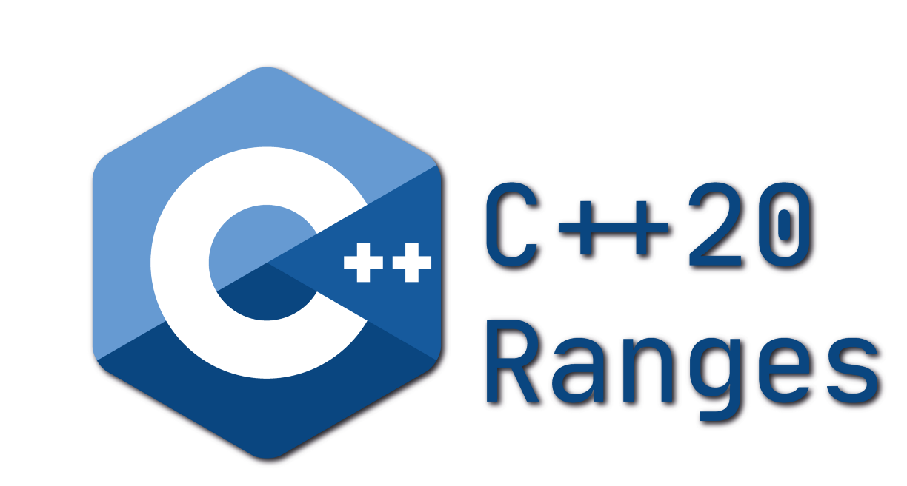

# Die C++&ndash;20 Bibliothek &ldquo;*Ranges*&rdquo;

[Zurück](../../Readme.md)

---

(Quelle: [Blog von Simon Tóth](https://itnext.io/c-20-ranges-complete-guide-4d26e3511db0))

---

## [Einleitung](Readme_00_Motivation.md)

## [Redesign der STL Algorithmen: Range-basierte Algorithmen](Readme_01_Algorithms.md)

## [Bereiche und Ansichten: Erläuterungen und Beispiele](Readme_02_Ranges_Views.md)

## [Ranges und Views in Standard C++&ndash;20 und C++&ndash;23](Readme_03_Standard_Views.md)

## [Implementierung einer View](Readme_04_ViewImplementation.md)

## [Einige allgemeine Beispiele](Readme_05_MiscExamples.md)

## [Einige &ldquo;Real-World&rdquo;-Aufgaben](Readme_06_RealWorldExamples.md)

---

[Zurück](../../Readme.md)

---

