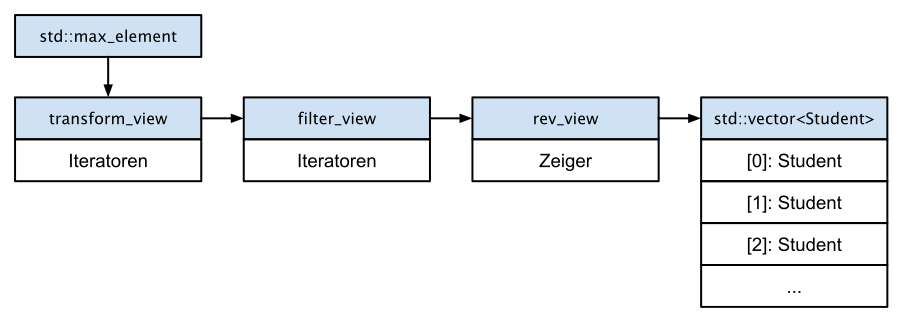

# Bereiche und Ansichten / *Ranges* und *Views*

[Zurück](Readme.md)

---

[Quellcode](Ranges_02_Ranges_View.cpp)

---

## Einleitung

Folgende Beweggründe haben zur Entwicklung der &ldquo;*Ranges*&rdquo;-Bibliothek geführt:

  * Die Fähigkeit, Algorithmen miteinander verknüpfen zu können &ndash; und dies ohne unnötige temporäre Container-Kopien.
  * Mit dem Sprachmittel `concept`, das *Requirements* an Iteratoren und Bereiche stellt, kann der Quellcode
    jetzt besser vom Compiler geprüft werden.
  * *Views* aus der &ldquo;*Ranges*&rdquo;-Bibliothek sind *das* mächtige Hilfsmittel, das es ermöglicht,
    auf einem Ausgangsbereich mehrere Transformationen in einer &ldquo;*lazy*&rdquo; evaluierten Darstellung miteinander zu verknüpfen.
    Dabei kommt es **nicht** zur Erzeugung von überflüssigen Zwischenkopien des Ausgangsbereichs.


Es folgen einige weiterführende Betrachungen zu *Views*:

  * #### [Motivation](#link1)
  * #### [Ein erster Blick auf *Views*](#link2)
  * #### [Komposition von *Views*](#link3)
  * #### [Projektionen](#link4)
  * #### [*Views* besitzen Bereichsadaptoren](#link5)
  * #### [*Views* modifizieren den zugrunde liegenden Container nicht](#link6)
  * #### [&ldquo;Materialisierung&rdquo; von *Views*](#link7)
  * #### [&ldquo;*Lazy*&rdquo; Evaluierung](#link8)
  * #### [Bereichsfabriken / Range Factories](#link9)
  * #### [Der Zweck von `std::common_view`](#link10)   
  * #### [*Borrowed Iterators*](#link11)


## Motivation <a name="link1"></a>

Wir wollen die Aussagen aus der Einleitung an einem Beispiel verdeutlichen:

###### C++&ndash;17  Variante

<pre>
01: static void test()
02: {
03:     struct Student {
04:         std::string m_name{};
05:         int m_year{};
06:         int m_score{};
07:     };
08: 
09:     auto getMaxScore = [](const std::vector<Student>& students, int year)
10:     {
11:         // student list needs to be <b>copied</b> in order to be filtered on the year
12:         auto result = std::vector<Student>{};
13: 
14:         std::copy_if(
15:             std::begin(students),
16:             std::end(students),
17:             std::back_inserter(result),
18:             [=](const auto& student) { return student.m_year == year; }
19:         );
20: 
21:         auto it = std::max_element(
22:             std::begin(result),
23:             std::end(result),
24:             [](const Student& a, const Student& b) {
25:                 return a.m_score < b.m_score;
26:             }
27:         );
28: 
29:         return it != result.end() ? it->m_score : -1;
30:     };
31: 
32:     auto students = std::vector<Student>
33:     {
34:         {"Georg", 2021, 120 },
35:         {"Hans",  2021, 140 },
36:         {"Susan", 2020, 180 },
37:         {"Mike",  2020, 110 },
38:         {"Hello", 2021, 190 },
39:         {"Franz", 2021, 110 },
40:     };
41: 
42:     auto score = getMaxScore(students, 2021);
43: 
44:     std::cout << score << std::endl;
45: }
</pre>

*Ausgabe*:

```
190
```

*Bemerkung*:<br />
Natürlich ließe sich die Berechnung auch einfacher durchführen,
zum Beispiel so:

```cpp
01: auto getMaxScoreAlternate = [](const std::vector<Student>& students, int year) {
02:     auto max_score = 0;
03:     for (const auto& student : students) {
04:         if (student.m_year == year) {
05:             max_score = std::max(max_score, student.m_score);
06:         }
07:     }
08:     return max_score;
09: };
```

Das Ziel in der Programmierung derartiger Funktionalitäten sollte darin bestehen,
den Algorithmus durch die Zusammenstellung kleiner algorithmischer Bausteine zu implementieren,
anstatt ihn für jeden Anwendungsfall von Grund auf mit einer einzigen `for`-Schleife zu realisieren.


###### C++&ndash;23 &ndash; Variante:

<pre>
01: void test()
02: {
03:     struct Student {
04:         std::string m_name{};
05:         int m_year{};
06:         int m_score{};
07:     };
08: 
09:     auto getMaxScore = [](const std::vector<Student>& students, int year) {
10: 
11:         auto maxValue = [](auto&& range) {
12:             const auto it = std::ranges::max_element(range);
13:             return it != range.end() ? *it : -1;
14:         };
15: 
16:         const auto byYear = [=](auto&& s) { return s.m_year == year; };
17: 
18:         return maxValue(students
19:             | std::ranges::views::filter(byYear)
20:             | std::ranges::views::transform(&Student::m_score)
21:         );
22:     };
23: 
24:     auto students = std::vector<Student>
25:     {
26:         {"Georg", 2021, 120 },
27:         {"Hans",  2021, 140 },
28:         {"Susan", 2020, 180 },
29:         {"Mike",  2020, 110 },
30:         {"Hello", 2021, 190 },
31:         {"Franz", 2021, 110 },
32:     };
33: 
34:     auto score = getMaxScore(students, 2021);
35: 
36:     std::println("{}", score);
37: }
</pre>

## Ein erster Blick auf *Views* <a name="link2"></a>

*Views* in der &ldquo;*Ranges*&rdquo;-Bibliothek sind *lazy* ausgewertete Iteratoren eines Bereichs.

Technisch betrachtet sind sie sehr ähnlich mit den klassischen STL-Iteratoren, nur mit integrierter Logik.

Syntaktisch gesehen bieten sie eine sehr angenehme Syntax für viele gängige Operationen:

*Beispiel*:
Quadrieren aller Elemente eines Containers

```cpp
01: static void test()
02: {
03:     auto numbers = std::vector{ 1, 2, 3, 4, 5, 6, 7, 8, 9, 10 };
04: 
05:     auto square = [](auto v) { return v * v; };
06: 
07:     auto squared_view = std::ranges::views::transform(numbers, square);
08: 
09:     for (auto&& s : squared_view) {
10:         std::print("{}, ", s);
11:     }
12:     std::println("");
13: }
```

*Ausgabe*:

```
1, 4, 9, 16, 25, 36, 49, 64, 81, 100,
```

*Bemerkung*:<br />
Die Schreibweise in Zeile 7 des letzten Beispiels kann durch den *Pipe*-Operator (`|`)
verbessert werden:

```cpp
01: static void test()
02: {
03:     auto numbers = std::vector{ 1, 2, 3, 4, 5, 6, 7, 8, 9, 10 };
04: 
05:     auto square = [](auto v) { return v * v; };
06: 
07:     auto squared_view = numbers | std::ranges::views::transform(square);
08: 
09:     for (auto&& s : squared_view) {
10:         std::print("{}, ", s);
11:     }
12:     std::println("");
13: }
```

Siehe hierzu mehr im nächsten Abschnitt.


*Beispiel*:
Erstellen einer gefilterte Ansicht, in der nur ein Teil des Bereichs sichtbar ist.
In diesem Fall treten nur die Elemente in Erscheinung, die die Bedingung erfüllen,
wenn die Ansicht iteriert wird:

```cpp
01: static void test()
02: {
03:     // create a filtered view where only a part of the range is visible
04:     auto numbers = std::vector{ 1, 2, 3, 4, 5, 6, 7, 8, 9, 10 };
05: 
06:     auto oddView = numbers
07:         | std::ranges::views::filter([](auto i) { return (i % 2) == 1; });
08: 
09:     for (auto&& s : oddView) {
10:         std::print("{}, ", s);
11:     }
12:     std::println("");
13: }
```

*Ausgabe*:

```
1, 3, 5, 7, 9,
```

*Beispiel*:
Ein weiteres Beispiel für die Vielseitigkeit der *Ranges*-Bibliothek ist die Möglichkeit,
eine Ansicht zu erstellen,
die über mehrere Container iterieren kann, als ob es sich um eine einzelnen Container handeln würde:


```cpp
01: static void test()
02: {
03:     auto list_of_lists = std::vector<std::vector<int>>
04:     {
05:         { 1, 2 },
06:         { 3, 4, 5 },
07:         { 6 },
08:         { 7, 8, 9, 10 }
09:     };
10: 
11:     auto flattenedView = std::ranges::views::join(list_of_lists);
12: 
13:     for (auto&& s : flattenedView) {
14:         std::print("{}, ", s);
15:     }
16:     std::println("");
17: 
18:     auto maxValue = *std::ranges::max_element(flattenedView);
19:     std::println("Maximum value: {}", maxValue);
20: }
```

*Ausgabe*:

```
1, 2, 3, 4, 5, 6, 7, 8, 9, 10,
Maximum value: 10
```

## Komposition von *Views* <a name="link3"></a>

Die eigentliche Stärke von *Views* liegt darin, dass sie miteinander verknüpft werden können.
Da sie die zugrunde liegenden Daten *nicht* kopieren,
lassen sich mehrere Transformationen
auf einem Bereich formulieren, was intern nur in Iteratoren-Aufrufen resultiert.

Das erste Beispiel verwendet die tatsächlichen *Views*-Klassen direkt.
Dies bedeutet, dass der visuell mächtige Pipe-Operator noch nicht zum Einsatz gelangt:

```cpp
01: static void test()
02: {
03:     struct Student {
04:         std::string m_name{};
05:         int m_year{};
06:         int m_score{};
07:     };
08: 
09:     auto getMaxScore = [](const std::vector<Student>& s, int year) {
10: 
11:         auto byYear = [=](const auto& s) { return s.m_year == year; };
12: 
13:         auto view1 = std::ranges::ref_view{ s };                     // wrap container in a view
14: 
15:         auto view2 = std::ranges::filter_view{ view1, byYear };      // apply 'filter' view
16: 
17:         auto view3 = std::ranges::transform_view{ view2, &Student::m_score };  // apply 'transform' view
18: 
19:         auto it = std::ranges::max_element(view3);                   // apply 'max_element' view
20: 
21:         return it != view3.end() ? *it : 0;
22:     };
23: 
24:     auto students = std::vector<Student>
25:     {
26:         {"Georg", 2021, 120 },
27:         {"Hans",  2021, 140 },
28:         {"Susan", 2020, 180 },
29:         {"Mike",  2020, 110 },
30:         {"Hello", 2021, 190 },
31:         {"Franz", 2021, 110 },
32:     };
33: 
34:     auto score = getMaxScore(students, 2021);
35:     auto scoreAlternate = getMaxScoreAlternate(students, 2021);
36: 
37:     std::println("Score: {}", score);
38:     std::println("scoreAlternate: {}", scoreAlternate);
39: }
```

*Ausgabe*:

```
190
```

Wir beginnen mit der Erstellung eines `std::ranges::ref_view`-Objekts,
einer Hülle um einen Container.
In unserem Fall verwandelt es das `std::vector`-Objekt in eine Ansicht.
Dies erfüllt den Zweck, dass die nächste Ansicht, Klasse `std::ranges::filter_view`, zum Einsatz kommen kann,
da sie als ersten Parameter eine Ansicht erfordert.
Auf diese Weise kann man eine Kette von komponierbaren Ansichten bilden,
die beliebig lang sein kann.



*Abbildung* 1: Der Algorithmus der obersten Ebene, `std::ranges::max_element()`, zieht Werte aus den *Views*,
die im Sinne der *Lazy*-Vorgehensweise die Elemente aus dem unterlagerten Container (`std::vector`) verarbeiten.

Wir könnten das letzte Beispiel auch kompakter formulieren,
indem wir die temporären Variablen `view1`, `view2` und `view3` entfernen:

```
01: auto getMaxScoreAlternate = [](const std::vector<Student>& s, int year) {
02: 
03:     auto byYear = [=](const auto& s) { return s.m_year == year; };
04: 
05:     auto scores = std::ranges::transform_view {
06:         std::ranges::filter_view {
07:             std::ranges::ref_view{s}, 
08:             byYear
09:         },
10:         &Student::m_score
11:     };
12: 
13:     auto it = std::ranges::max_element(scores);
14: 
15:     return it != scores.end() ? *it : 0;
16: };
```

*Hinweis*: Die `_view`-Klassen wurden dem Namensraum  `std::ranges` zugeordnet.


## Projektionen <a name="link4"></a>


Viele der Range-basierten Algorithmen akzeptieren einen zusätzlichen, optionalen Template Parameter,
eine so genannte &ldquo;Projektion&bdquo;.

Mit diesem optionalen Zusatzparameter kann man für jedes Element eine Transformation (Projektion) festlegen,
bevor der Algorithmus mit diesem neuen Wert weiterarbeitet.

Wir sehen uns dies am besten an einem Beispiel an:

```cpp
01: class Person
02: {
03: public:
04:     explicit Person(std::string first, std::string last)
05:         : m_firstName{ first }, m_lastName{ last }
06:     {}
07: 
08:     const std::string& getFirstName() const { return m_firstName; }
09:     const std::string& getLastName() const { return m_lastName; }
10: 
11: private:
12:     std::string m_firstName;
13:     std::string m_lastName;
14: };
```

Der folgende Code speichert einige `Person`-Objekte in einem `std::vector`-Objekt:

```cpp
01: std::vector<Person> persons
02: {
03:     Person{ "John", "Miller" },
04:     Person{ "Jack", "Wagner" }
05: };
```

Da die `Person`-Klasse den Operator `<` nicht implementiert,
können Sie diesen Vektor nicht mit dem normalen `std::sort()`-Algorithmus sortieren,
da er Elemente mit dem Operator `<` vergleicht.

Folgende Anweisung lässt sich also nicht kompilieren:

```cpp
std::sort(std::begin(persons), std::end(persons));            // Error
```

Der Wechsel zum *Range-based* Algorithmus `ranges::sort()` hilft auf den ersten Blick nicht viel.
Folgende Anweisung lässt sich immer noch nicht kompilieren,
da der Algorithmus immer noch nicht weiß, wie er Elemente eines `std::vector`-Objekt
und damit eines Bereichs vergleichen soll:


```cpp
std::ranges::sort(std::begin(persons), std::end(persons));   // Error
```


Sie können Personen jedoch nach ihrem Vornamen sortieren,
indem Sie eine *Projektions*-Funktion für den Sortieralgorithmus angeben,
um jede Person nach ihrem Vornamen zu projizieren.

Der Projektions-Parameter ist der dritte,
daher müssen wir auch den zweiten Parameter angeben,
der der zu verwendende Komparator ist, standardmäßig `std::ranges::less`.

Im folgenden Aufruf gibt `{}` an, den Standardkomparator zu verwenden,
und die Projektionsfunktion wird als Lambda-Ausdruck angegeben:

```cpp
01: std::ranges::sort(
02:     std::begin(persons),
03:     std::end(persons),
04:     std::ranges::less{},
05:     [](const Person& person) { return person.getLastName(); }
06: );
```

Oder noch kürzer im folgenden Aufruf mit`{}`. Diese Notation bringt zum Ausdruck,
dass der Standardkomparator `std::ranges::less` verwendet wird:


```cpp
01: std::ranges::sort(
02:     std::begin(persons),
03:     std::end(persons),
04:     {},
05:     &Person::getFirstName
06: );
```

Je nach Verwendung des Vor- oder Nachnamens erhält man die Ausgabe

```
John Miller
Jack Wagner
```

oder


```
Jack Wagner
John Miller
```


## *Views* besitzen Bereichsadaptoren <a name="link5"></a>

Wie Sie bereits gesehen haben, können wir mit der &ldquo;*Ranges*&rdquo;-Bibliothek auch Ansichten erstellen,
die mit Pipe-Operatoren &ndash; und eben dann mit Bereichsadaptoren &ndash; eine viel elegantere Syntax besitzen.

Die Fähigkeit, eine Anweisung von links nach rechts anstatt sie von innen nach außen zu lesen, macht den
Code leichter lesbar:

*Hinweis*: Die Bereichsadaptoren wurden dem Namensraum  `std::views` zugeordnet.


```cpp
01: static void test()
02: {
03:     struct Student {
04:         std::string m_name{};
05:         int m_year{};
06:         int m_score{};
07:     };
08: 
09:     auto students = std::vector<Student>{
10:         {"Georg", 2021, 120 },
11:         {"Hans",  2021, 140 },
12:         {"Susan", 2020, 180 },
13:         {"Mike",  2020, 110 },
14:         {"Hello", 2021, 190 },
15:         {"Franz", 2021, 110 },
16:     };
17: 
18:     int year = 2021;
19: 
20:     auto byYear = [=](const auto& s) { return s.m_year == year; };
21: 
22:     auto scores = students 
23:         | std::ranges::views::filter(byYear) 
24:         | std::ranges::views::transform(&Student::m_score);
25: 
26:     auto it = std::ranges::max_element(scores);
27:     auto score = it != scores.end() ? *it : 0;
28: 
29:     std::println("Score: {}", score);
30: }
```

*Ausgabe*:

```
Score: 190
```

Jede *View* in der &ldquo;*Ranges*&rdquo;-Bibliothek verfügt über ein entsprechendes Bereichsadapterobjekt, das
zusammen mit dem Pipe-Operator verwendet werden kann.

Bei Verwendung der Bereichsadapterobjekte können wir auch das
zusätzliche `std::ranges::ref_view`-Objekt weglassen!


## *Views* modifizieren den zugrunde liegenden Container nicht <a name="link6"></a>

Auf den ersten Blick könnte eine Ansicht wie eine veränderte Version des Eingabecontainers aussehen.
Dies ist nicht der Fall: Die gesamte Verarbeitung wird in den Iterator-Objekten durchgeführt,
eine *View* ist nur ein *Proxy*-Objekt!

```cpp
01: static void test()
02: {
03:     auto numbers = std::list{ 1, 2, 3, 4, 5, 6 };
04: 
05:     auto strings = numbers | std::ranges::views::transform([](auto i) {
06:         return std::string{"\""} + std::to_string(i) + std::string{ "\"" };
07:         }
08:     );
09: 
10:     for (const auto& s : strings) {
11:         std::print("{}, ", s);
12:     }
13:     std::println("");
14: 
15:     for (const auto& n : numbers) {
16:         std::print("{}, ", n);
17:     }
18:     std::println("");
19: }
```

*Ausgabe*:

```
"1", "2", "3", "4", "5", "6",
1, 2, 3, 4, 5, 6,
```

Prinzipiell stellt sich damit natürlich die Frage, wie Resultate von Transformationen &ndash; also *Views* &ndash; in
einem Ergebnis-Container abgespeichert werden können.

## &ldquo;Materialisierung&rdquo; von *Views* <a name="link7"></a>

Der Ergebnis der Transformation von *Views*  kann man in einem Container abspeichern.
Man spricht hier auch von &ldquo;die Ansicht materialisieren&rdquo;.

Alle *Views* können prinzipiell in Containern materialisiert werden, aber:
Ein Funktions-Template namens `std::ranges::to<T>()`, das diese Funktionalität besitzt,
wurde für C++&ndash;20 vorgeschlagen, hat es aber dann doch nicht zur Verabschiedung in den Standard geschafft.

Mit C++&ndash;23 können wir diese Lücke nun ausmerzen:

```cpp
01: static void test()
02: {
03:     auto numbers = std::list{ 1, 2, 3, 4, 5, 6 };
04: 
05:     auto numberToString = [](auto i) {
06:         return std::string{ "\"" } + std::to_string(i) + std::string{ "\"" };
07:     }; 
08: 
09:     auto strings = numbers | std::ranges::views::transform(numberToString);
10: 
11:     std::vector<std::string> vec{};
12: 
13:     std::ranges::copy(strings, std::back_inserter(vec));
14: 
15:     for (const auto& n : vec) {
16:         std::print("{}, ", n);
17:     }
18:     std::println("");
19: 
20:     vec.clear();
21: 
22:     vec = std::ranges::to<std::vector<std::string>>(strings);
23: 
24:     for (const auto& n : vec) {
25:         std::print("{}, ", n);
26:     }
27:     std::println("");
28: }
```

*Ausgabe*:

```
"1", "2", "3", "4", "5", "6",
"1", "2", "3", "4", "5", "6",
```

## &ldquo;*Lazy*&rdquo; Evaluierung <a name="link8"></a>

Die gesamte Arbeit, die eine *View* verrichtet, basiert auf der *lazy*-Vorgehensweise.
Dies erfolgt somit im Gegensatz zu allen Funktionen aus der `<algorithm>`-Headerdatei,
die ihre Arbeit *immediately* (auch als *eager* bezeichnet),
also sofort ausführen, wenn sie aufgerufen werden.

Wenn wir *Views* als Bausteine in Ketten verwenden,
profitieren wir von der *lazy*-Auswertungsvorgehensweise, da wir unnötige Kopien vermeiden.

Wie sieht es aber mit *Views* aus, die einen *Eager*-Algorithmus benötigen würden?
Zum Beispiel `std::sort`? Die Antwort lautet: Dies geht nicht!

Wir müssen in diesem Fall die Ansicht vorher materialisieren, wenn wir sie sortieren möchten:

```cpp
01: static void test()
02: {
03:     auto vec = std::vector{ 4, 2, 7, 1, 2, 6, 3, 5 };
04:     for (auto&& s : vec) {
05:         std::print("{} ", s);
06:     }
07:     std::println("");
08: 
09:     // filter range
10:     auto isOdd = [](auto i) { return i % 2 == 1; };
11: 
12:     auto odd_numbers = vec | std::ranges::views::filter(isOdd);
13: 
14:     // std::ranges::sort(odd_numbers); // doesn't compile !!!
15: 
16:     // materialize the view before sorting
17:     auto result = std::ranges::to<std::vector<int>>(odd_numbers);
18:     for (auto&& s : result) {
19:         std::print("{} ", s);
20:     }
21:     std::println("");
22: 
23:     // sort range
24:     std::ranges::sort(result);
25:     for (auto&& s : result) {
26:         std::print("{} ", s);
27:     }
28:     std::println("");
29: }
```

*Ausgabe*:

```
4 2 7 1 2 6 3 5
7 1 3 5
1 3 5 7
```

*Hinweis*:
Eines der Probleme in diesem Zusammenhang ist,
dass sich der Übersetzer über die Iteratortypen beschwert, die von einer bestimmten *View* bereitgestellt werden.
Der Sortieralgorithmus erfordert *Random-Access*-Iteratoren!
Dies muss aber nicht der Typ der Iteratoren sein, die eine *View* besitzt,
obwohl der zugrunde liegende Eingabecontainer beispielsweise ein `std::vector`-Objekt ist!

Manchmal lassen sich auch Workarounds finden, die ein Materialisieren der *View* umgehen, 
siehe das folgende Beispiel:


```cpp
01: static void test()
02: {
03:     auto vec = std::vector{ 8, 6, 10, 9, 2, 1, 3, 7, 4, 5 };
04:     print(vec);
05: 
06:     // filter range
07:     auto firstHalf = vec | std::views::take(vec.size());
08:     std::ranges::sort(firstHalf);
09:     print(firstHalf);
10: 
11:     std::ranges::sort(firstHalf, std::greater<>{});
12:     print(firstHalf);
13: }
```

*Ausgabe*:

```
8 6 10 9 2 1 3 7 4 5
1 2 3 4 5 6 7 8 9 10
10 9 8 7 6 5 4 3 2 1
```


---

## Bereichsfabriken / Range Factories  <a name="link9"></a>

Die Ranges-Bibliothek stellt die folgenden Bereichsfabriken / Range-Factorys zum Erstellen von Ansichten bereit,
die Elemente bei Bedarf *lazy* erzeugen:

| *Range Factory* | Beschreibung |
|:-- |:----|
| `std::ranges::empty_view` | Erzeugt eine leere Ansicht. |
| `std::ranges::single_view` | Erzeugt eine Ansicht mit einem einzigen Element. | 
| `std::ranges::iota_view` | Erstellt eine unendliche oder begrenzte Ansicht, die Elemente enthält, die mit einem Anfangswert beginnen und in der jedes nachfolgende Element einen Wert hat, der dem um eins erhöhten Wert des vorherigen Elements entspricht. |
| `std::ranges::repeat_view` | Erstellt eine Ansicht, die einen bestimmten Wert wiederholt. Die resultierende Ansicht kann unbegrenzt (unendlich) oder durch eine bestimmte Anzahl von Werten begrenzt sein. |
| `std::ranges::basic_istream_view`<br /> `istream_view` | Erstellt eine Ansicht mit Elementen, die durch Aufrufen des Rechtsshift-Operators `operator>>` für einen zugrunde liegenden Eingabestream abgerufen werden. |

*Tabelle* 1. Bereichsfabriken.

Im Quellcode finden Sie eine Reihe von Beispielen zu den Bereichsfabriken.

Zu `std::ranges::iota_view` hier ein Listing:

```cpp
01: static void printRange(std::string_view msg, auto&& range)
02: {
03:     std::println("{}", msg);
04: 
05:     for (const auto& elem : range) {
06:         std::println("# {}", elem);
07:     }
08:     std::println("");
09: }
10: 
11: static void test()
12: {
13:     auto range = std::ranges::views::iota(10);
14: 
15:     auto result { range
16:         | std::ranges::views::filter([](const auto& value) { return value % 2 == 0; })
17:         | std::ranges::views::transform([](const auto& value) { return value * 2.0; })
18:         | std::ranges::views::take(5)
19:     };
20: 
21:     printRange("Result: ", result);
22: }
```

*Ausgabe*:

```
Result:
# 20
# 24
# 28
# 32
# 36
```


---

## Der Zweck von `std::common_view` <a name="link10"></a>

Manche der STL-Algorithmen, wie zum Beispiel `std::accumulate`, werden von 
der &ldquo;*Ranges*&rdquo;-Bibliothek nicht unterstützt.
Wenn wir nun *Views* und ältere STL-Algorithmen mischen,
dann kann es zu Übersetzungsfehlern kommen:

```cpp
01: static void test()
02: {
03:     std::vector<int> vec{ 9, 8, 7, 6, 5, 4, 3, 2, 1 };
04: 
05:     auto range = vec
06:         | std::ranges::views::take_while([](int x) { return x > 5; });
07: 
08:     // auto result = std::accumulate(std::begin(range), std::end(range), 0);  // <== Compile Error
09: }
```

Um das Problem für `std::views::take_while` zu beheben,
müssen wir daher eine Konvertierung zu `std::views::common` hinzufügen.
Der Zweck von `common_view` (`std::ranges::common_view`) besteht darin,
einen C++ 20-Bereich mit einem *Sentinel*-Typ zu nehmen,
der sich von seinem Iteratortyp unterscheidet,
und ihn an die Arbeit mit C++17-Algorithmen anzupassen (hier: `std::accumulate`),
indem derselbe Iterator- und *Sentinel*-Typ erzeugt wird:

```cpp
01: static void test()
02: {
03:     std::vector<int> vec{ 9, 8, 7, 6, 5, 4, 3, 2, 1 };
04: 
05:     auto range = vec
06:         | std::ranges::views::take_while([](int x) { return x > 5; })
07:         | std::ranges::views::common;
08: 
09:     auto result = std::accumulate(std::begin(range), std::end(range), 0);
10: 
11:     std::println("{}", result);
12: }
```

*Bemerkung*: Ein *Sentinel*-Typ ist ähnlich einem Ende-Iterator-Objekt,
nur dass dieses einen anderen Typ hat.

---


## *Borrowed Iterators* <a name="link11"></a>

Viele Algorithmen geben Iteratorenobjekte in die Bereiche (*Ranges*) zurück, mit denen sie arbeiten.

Wenn wir jedoch Bereiche als einzelnes Argument übergeben, kann ein neues Problem auftreten,
das nicht möglich war, wenn ein Bereich zwei Argumente übergeben bekommen hat
(den Anfangsiterator &ndash; `begin()` &ndash; und den Endeiterator &ndash; `begin()` &ndash; ):

Wenn Sie einen temporären Bereich übergeben (z.B. einen von einer Funktion zurückgegebenen Bereich)
und einen Iterator an ihn zurückgeben,
kann der zurückgegebene Iterator am Ende der Anweisung ungültig werden, wenn der Bereich zerstört wird.

Die Verwendung des zurückgegebenen Iterators (oder einer Kopie davon) würde zu undefiniertem Verhalten führen.

Hierzu ein Beispiel:

```cpp
01: static std::vector<int> getData()
02: {
03:     return std::vector<int> { 1, 2, 3, 4, 5};
04: }
05: 
06: static void views11_23_borrowedIterators_01()
07: {
08:     auto pos = std::ranges::find(getData(), 123); // returns iterator to temporary vector
09: 
10:     // temporary vector returned by getData() is destroyed here
11: 
12:     std::cout << *pos;    // OOPS: using a dangling iterator // DOES NOT COMPILE !!!
13: }
```

Um dieses Problem zu lösen, hat die Ranges-Bibliothek das Konzept des *Borrowed Iterators* eingeführt.

Ein *Borrowed Iterator* stellt sicher, dass seine Lebensdauer nicht von einem temporären Objekt abhängt,
das möglicherweise zerstört wurde. Zu weiteren Informationen verweise ich auf die einschlägige Fachliteratur.


---


## Literaturhinweise: 

Die Anregungen zu den Beispielen stammen zum großen Teil aus dem Buch

&ldquo;[C++ High Performance](https://www.amazon.de/High-Performance-Master-optimizing-functioning/dp/1839216549/)&rdquo;
von Björn Andrist und Viktor Sehr.

Die Thematik `std::views::common` findet man
[hier](https://www.walletfox.com/course/ranges_views_common.php)
gut beschrieben.

---

[Zurück](Readme.md)

---
