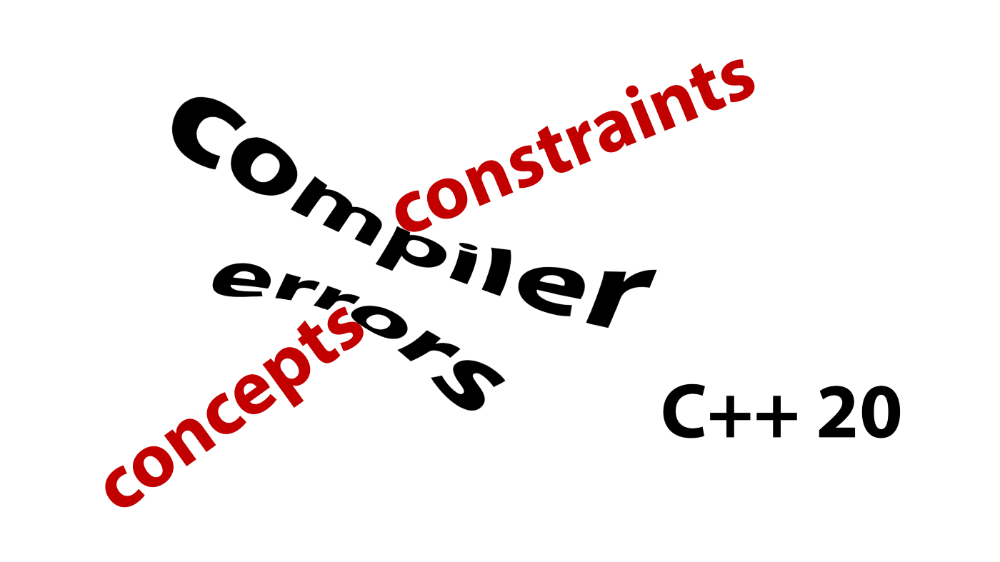

# Concepts

[Zurück](../../Readme.md)

---

(Quelle: [Blog von Simon Tóth](https://itnext.io/c-20-concepts-complete-guide-42c9e009c6bf))

---

## [Überblick](Readme_01_Overview.md)

## [Mehr Details](Readme_02_MoreDetails.md)

## [Requires Ausdrücke versus Requires Klausel](Readme_02_MoreDetails.md)

## [Mehr Details](Readme_02_MoreDetails.md)

## [Aufgaben](Readme_03_Exercises.md)

---

[Zurück](../../Readme.md)

---
