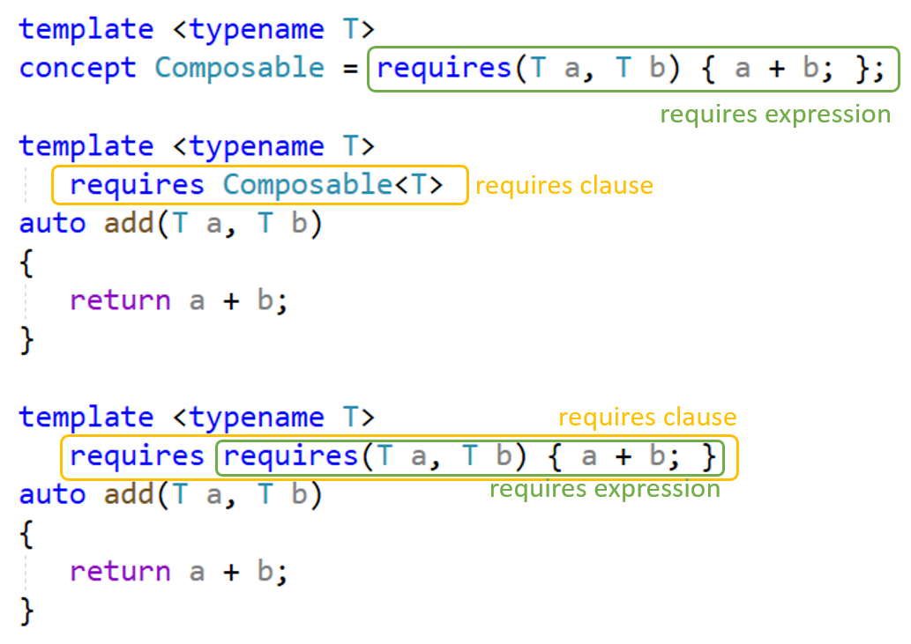

# Requires Ausdrücke versus Requires Klausel

[Zurück](Readme.md)

---

[Quellcode](Concepts_03_ReqClauseVsReqExp.cpp)

---

## Einleitung

Wir betrachten in diesem Abschnitt zwei neue Schlüsselwörter `concept` und `requires`.

Ersteres wird verwendet, um ein Konzept (*Concept*) zu deklarieren,
während letzteres verwendet wird, um einen Requires-Ausdruck oder eine Requires-Klausel einzuführen.

Diese beiden könnten zunächst Verwirrung stiften, also schauen wir uns an, was was ist und was ihr Zweck ist:



In diesem Ausschnitt haben wir Folgendes:

  * Ein Konzept namens `Composable`, dessen Rumpf aus einem Requires-Ausdruck besteht
  (wiederum aus einem einzigen *Contraint* bestehend).
  Der Requires-Ausdruck lautet `requires (T a, T b) { a + b; }`.

  * Ein Funktions-Template namens `add`, das sein Tempalte Argument `T`
  mit Hilfe des `Composable`-Konzepts innerhalb einer Requires-Klausel einschränkt.
  Diese lautet `requires Composable<T>`.

  * Ein Funktions-Template, ebenfalls `add` genannt, das sein Template-Argument `T`
  durch den Requires-Ausdruck
  `require(T a, T b) { a + b; }` einschränkt,
  und zwar direkt in einer Requires-Klausel (`requires require(T a, T b) { a + b; }`).


Es gibt 4 unterschiedliche Requires Ausdrücke:

  * Einfaches Requirement (*Simple Requirement*)
  * Typ Requirement (*Type Requirement*)
  * Verbund Requirement (*Compound Requirement*)
  * Geschachteltes Requirement (*Nested Requirement*)


## Ein Requires-Ausdruck ist ein Compile-Time-Ausdruck vom Typ `bool`

Ein Requires-Ausdruck ist ein Compile-Time-Ausdruck vom Typ `bool`
und kann überall dort erscheinen, wo ein boolescher Wert zur Kompilierzeit erscheinen kann
(z. B. `if constexpr`- oder `static_assert`-Anweisungen).
Requires-Ausdrücke sind nicht auf den Rumpf von Konzepten oder in Requires-Klauseln beschränkt.

Hier ein Beispiel mehrerer Requires-Ausdrücke,
die im Hauptteil eines Funktions-Templates verwendet werden:


###### Beispiel:

```cpp
01: struct point
02: {
03:     int x;
04:     int y;
05: };
06: 
07: std::ostream& operator<<(std::ostream& os, point const& p)
08: {
09:     os << '(' << p.x << ',' << p.y << ')';
10:     return os;
11: }
12: 
13: template <typename T>
14: constexpr bool always_false = std::false_type::value;
15: 
16: template <typename T>
17: std::string as_string(T a)
18: {
19:     constexpr bool has_to_string = requires(T x)
20:     {
21:         { std::to_string(x) } -> std::convertible_to<std::string>;
22:     };
23: 
24:     constexpr bool has_stream = requires(T x, std::ostream & os)
25:     {
26:         {os << x} -> std::same_as<std::ostream&>;
27:     };
28: 
29:     if constexpr (has_to_string)
30:     {
31:         return std::to_string(a);
32:     }
33:     else if constexpr (has_stream)
34:     {
35:         std::stringstream s;
36:         s << a;
37:         return s.str();
38:     }
39:     else
40:         static_assert(always_false<T>, "The type cannot be serialized");
41: }
```

## Zusammenfassung


  * Ein **Requires-Ausdruck** ist ein boolescher Ausdruck, der in einer Requires-Klausel verwendet werden kann
  oder um den Rumpf eines Konzepts zu definieren (das wiederum mit einer Requires-Klausel verwendet wird).
  Der Zweck des Requires-Ausdrucks besteht darin, festzustellen, ob ein oder mehrere Ausdrücke wohlgeformt sind.
  Er hat keine Nebenwirkungen und beeinflusst das Verhalten des Programms nicht.

  * Eine **Requires-Klausel** verwendet einen booleschen Ausdruck zur Kompilierzeit,
  um Anforderungen (Requirements) an Template-Argumente oder Funktionsdeklarationen zu definieren.
  Sie wirkt sich auf das Verhalten eines Programms aus und bestimmt,
  ob eine Funktion an der Überladungsauflösung (*Overload Resolution*) teilnimmt oder nicht
  oder ob eine Tempalte-Instanziierung gültig ist.

---


## Literaturhinweise

Die Anregungen zu den Beispielen stammen aus einem Blog von *Marius Bancila*:

[Requires Expressions and Requires Clauses in C++ 20](https://mariusbancila.ro/blog/2022/06/20/requires-expressions-and-requires-clauses-in-cpp20/)

---

[Zurück](Readme.md)

---
