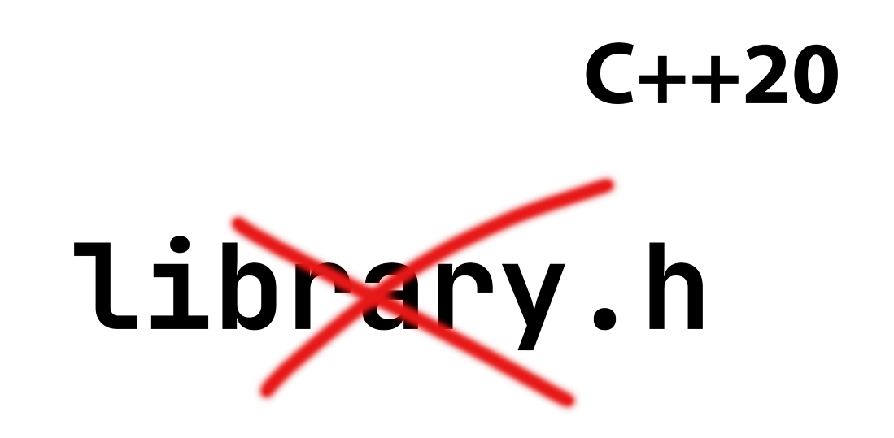

# Modules

[Zurück](../../Readme.md)

---



<sup>(Quelle: [Blog von Simon Tóth](https://itnext.io/c-20-modules-complete-guide-ae741ddbae3d))</sup>

---

## Einstellungen in Visual Studio

Die Anwendung des Modul-Konzepts in Visual Studio erfoderte einige Änderungen an den
Standard-Einstellungen. Ein Eintrag in
[stackoverflow](https://stackoverflow.com/questions/69006729/visual-studio-2019-cannot-import-c-standard-library-declaration-in-cpp-file)
beschreibt dies sehr gut (*Abbildung* 1):


*Abbildung* 1: Einstellungen in Visual Studio 

Neben der offensichtlichen Auswahl des C++ Sprachstandards 
(&ldquo;*Preview - Features from the Latest C++ Working Draft (`/std:c++latest`)*&rdquo;)
sind die nächsten zwei Einstellungen in der Menge aller Einstellungen nicht ganz einfach aufzuspüren:
Die Einstellung &ldquo;*Enable Experimental C++ Standard Library Mode*&rdquo;
ist auf den Wert &ldquo;`Yes (/experimental:module)`&rdquo; zu setzen:


*Abbildung* 2: Einstellung &ldquo;*Enable Experimental C++ Standard Library Mode*&rdquo;

Fehlt noch die Einstellung &ldquo;*Scan Sources for Module Dependencies*&rdquo; (*Abbildung* 3):


*Abbildung* 3: Einstellung &ldquo;*Scan Sources for Module Dependencies*&rdquo;

Hier ist der Wert &ldquo;`Yes`&rdquo; einzutragen.

---

## Erste Schritte

#### Import eines Standard-Moduls

```cpp
01: import <iostream>;
02: 
03: int main()
04: {
05:     std::cout << "Hello Modules :)";
06:     return 0;
07: }
```

*Ausgabe*:

<pre>
Hello Modules :)
</pre>

---

#### Erstellen eines separaten &ldquo;C++ Module Interface Unit&rdquo; Files

Module werden (unter Visual C++) in Dateien mit der Endung  &ldquo;.ixx&rdquo; abgelegt,
so genannten &ldquo;C++ Module Interface Unit&rdquo; Dateien:

```cpp
01: export module Module;
02: 
03: import <iostream>;
04: 
05: export void MyFunc();
06: 
07: void MyFunc() {
08:     std::cout << "Hello Modules again:)";
09: }
```

Damit kann ein Hauptprogramm so aussehen:

```cpp
01: import Module;
02: 
03: int main()
04: {
05:     MyFunc();
06:     return 0;
07: }
```

*Ausgabe*:

<pre>
Hello Modules again:)
</pre>

---

#### Einige weitere Konzepte von C++ 20 Modules

Neben Funktionen lassen sich auch

  * Strukturen
  * Klassen
  * Namensräume

in Modulen definieren und &ndash; bei Bedarf &ndash; exportieren.
Auch hierzu ein Beispiel:

```cpp
01: export module Module2;
02: 
03: import <iostream>;
04: import <string>;
05: 
06: // -------------------------------------------------------
07: // Interfaces
08: 
09: // public
10: export void anotherMyFunc();
11: 
12: export struct Point
13: {
14:     int m_x;
15:     int m_y;
16: };
17: 
18: export class Rectangle
19: {
20: private:
21:     Point m_upperLeft;
22:     int m_width;
23:     int m_height;
24: 
25: public:
26:     Rectangle(Point p, int width, int height) 
27:         : m_upperLeft{ p }, m_width{ width }, m_height{ height } {}
28: };
29: 
30: export namespace NamespaceExample {
31:     void connect() {
32:         std::cout << "connect" << std::endl;
33:     }
34:     void disconnect() {
35:         std::cout << "disconnect" << std::endl;
36:     }
37: }
38: 
39: namespace AnotherNamespaceExample {
40:     void doOutput(const std::string& s) {
41:         std::cout << s << std::endl;
42:     }
43:     export void doConnect() {
44:         doOutput("doConnect");
45:     }
46:     export void doDisconnect() {
47:         doOutput("doDisconnect");
48:     }
49: }
50: 
51: // private
52: void anotherMyFuncImpl();
53: 
54: // -------------------------------------------------------
55: // Implementation
56: 
57: void anotherMyFuncImpl()
58: {
59:     std::cout << "Another Hello Modules again:)" << std::endl;
60: }
61: 
62: void anotherMyFunc()
63: {
64:     anotherMyFuncImpl();
65: }
```

*Hauptprogramm*:

```cpp
01: int main()
02: {
03:     Point p{ 1, 2 };
04:     Rectangle r{ p, 10, 20 };
05: 
06:     NamespaceExample::connect();
07:     NamespaceExample::disconnect();
08: 
09:     AnotherNamespaceExample::doConnect();
10:     AnotherNamespaceExample::doDisconnect();
11:     // AnotherNamespaceExample::doOutput("bla");  // error
12:     return 0;
13: }

```

*Ausgabe*:

<pre>
connect
disconnect
doConnect
doDisconnect    
</pre>

---

[Zurück](../../Readme.md)

---

