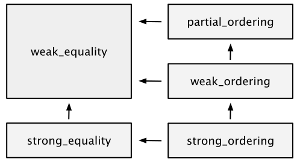

# Spaceship Operator / 3-Way Comparison Operator / 3-Weg-Vergleichsoperator 

[Zurück](../../Readme.md)

---

[Quellcode](SpaceshipOperator.cpp)

---

## Überblick

Der 3-Weg-Vergleichsoperator `<=>`, auch als *Spaceship*-Operator bezeichnet, bestimmt für zwei Objekte `A` und `B`,
ob `A < B`, `A == B` oder `A > B` gilt. Der Code für den  *Spaceship*-Operator kann vom Übersetzer automatisch generiert werden.
Historisch gesehen ist der *Spaceship*-Operator keine neue Erfindung, die `strcmp()`-Funktion aus C ist ähnlich definiert.
Bei zwei C-Zeichenketten wird eine ganz Zahl als Ergebnis zurückgegeben, wobei

  * &lt; 0 bedeutet, dass die erste Zeichenfolge kleiner ist
  * == 0 bedeutet, dass beide Zeichenfolgen gleich sind
  * &gt; 0 bedeutet, dass die erste Zeichenfolge größer ist

gilt. Es können also drei Ergebnisse vorhanden sein, daher die Begrifflichkeit des Drei-Wege-Vergleichs.

## Verschiedene Möglichkeiten einer Beziehung

> &ldquo;Nicht alle Gleichheitsbeziehungen sind gleich&rdquo;!

Mit dem 3-Weg-Vergleichsoperator können nicht nur Ordnungen (Beziegungen) und Gleichheit zwischen Objekten ausgedrückt werden,
sondern auch die Eigenschaften dieser Beziehungen. Dazu gibt es in C++ fünf so genannte *Beziehungsstärken*,
die wir an Hand einer Reihe von Beispielen betrachten:

#### `std::strong_ordering`

Hier gilt: Gleiche Objekte können nicht voneinander unterschieden werden.

  * Ein typisches Beispiel sind `int`-Variablen. Zwei Variablen `a` und `b` mit demselben Wert lassen sich nicht voneinander unterscheiden.

  * Ein zweites Beispiel: Betrachten wir eine Klasse `Rectangle` mit zwei Instanzvariablen `m_width` und `m_height`.
    Gilt für zwei `Rectangle` Objekte, dass deren `m_width`- und `m_height`-Instanzvariablen gleich sind,
    dann lassen sich auch die beiden `Rectangle` Objekte nicht voneinander unterscheiden.

#### `std::weak_ordering`

Objekte, die an Hand der Beziehungsstärke `std::weak_ordering` gleich sind, müssen nicht als soche gleich sein.

  * Beispiel: Für Zeichenketten &ndash; egal, ob hier die Klasse `std::string` oder eine andere benutzerdefinierte Klasse betrachtet wird &ndash;,
    kann man einen Vergleich definieren, der Groß- und Kleinschreibung außer Acht lässt.
    Zwei Zeichenketten `"ABC"` und `"abc"` wären an Hand dieser Definition dann gleich,
    die Objekte sind es nicht.

  * Ein zweites Beispiel: Für eine benutzerdefinierte Klasse `Rectangle` &ndash; möglicherweise wieder mit den Instanzvariablen `m_width` und `m_height` &ndash;
    legt man fest, dass zwei `Rectangle`-Objekte mit derselben Fläche gleich sind.

#### `std::partial_ordering`

Die Beziehungsstärke `std::partial_ordering` ist ähnlich zu `std::weak_ordering` nur mit dem Unterschied,
dass es manche Werte gibt, die sich überhaupt nicht miteinander vergleichen lassen.

  * Beispiel: Zum Datentyp `float` oder `double` gibt es den Wert NaN,
    der mit einem regulären Gleitpunktwert nicht verglichen werden kann.
    Man kann weder den Vergleich `5 < NaN` oder `5 > NaN` formulieren.
 
#### `std::strong_equality`

Es gibt &ndash; nicht wenige &ndash; Datentypen, für die eine Aussage &ldquo;Wert_1 ist kleiner als Wert_2&rdquo; keinen Sinn ergibt.

  * Beispiel: Um auf eine Datenbank zuzugreifen, gibt es zum Zwecke des Verbindungsaufbaus in den meisten Bibliotheken
    eine Klasse `SqlConnection`. Für zwei `SqlConnection`-Objekte `conn1` und `conn2` ergebene die Operatoren
    `<`, `<=`, `>` und `>=` keinen Sinn.

#### `std::weak_equality`

Ähnlich zu `std::weak_ordering`: Für an sich gleiche Objekte kann es eben doch Unterschiede geben.

---

## Die fünf Vergleichskategorien im Überblick

*Abbildung* 1: C++ Beziehungsstärken.

Nicht alle Vergleichsoperatoren sind für alle Beziehungsstärken vorhanden. Es gilt hier:

| Beziehungsstärken | Verfügbare Operatoren |
|:-------------- |-----------------------------------------|
| `std::strong_ordering`  | `==`  `!=`  `<`  `>`  `<=`  `>=` | 
| `std::weak_ordering`    | `==`  `!=`  `<`  `>`  `<=`  `>=` | 
| `std::partial_ordering` | `==`  `!=`  `<`  `>`  `<=`  `>=` | 
| `std::strong_equality`  | `==`  `!=` | 
| `std::weak_equality`    | `==`  `!=` | 

Tabelle 1.  C++&ndash;Beziehungsstärken und Operatoren.

---

## Der Quellcoode im Überblick

  * Namensraum `Spaceship_01_Operator_Equality`: Hier wird gezeigt, dass ab C++ 20 bei vorhandener
    `==`-Implementierung auch der entgegengesetzte Operator `!=` definiert ist.  

  * Namensraum `Spaceship_02_BuiltIn`: Der *Spaceship*-Operator `<=>`-Operator für Standard-Datentypen.  

  * Namensraum `Spaceship_03_Operator_Point`: Der *Spaceship*-Operator `<=>`-Operator automatisch erzeugt.

  * Namensraum `Spaceship_04_Operator_Fraction`: Der *Spaceship*-Operator `<=>`-Operator benutzer-definiert.

---

## Literaturhinweise:

Interessante Informationen und Beschreibungen des *Spaceship*-Operators finden sich zum Beispiel hier vor:

[Spaceship Operator](https://blog.tartanllama.xyz/spaceship-operator/)

[StackOverflow.com](https://stackoverflow.com/questions/47466358/what-is-the-spaceship-three-way-comparison-operator-in-c)

[Using C++20’s Three-way Comparison <=>](https://www.jonathanmueller.dev/)

[Simplify Your Code With Rocket Science](https://devblogs.microsoft.com/cppblog/simplify-your-code-with-rocket-science-c20s-spaceship-operator/)

---

[Zurück](../../Readme.md)

---
