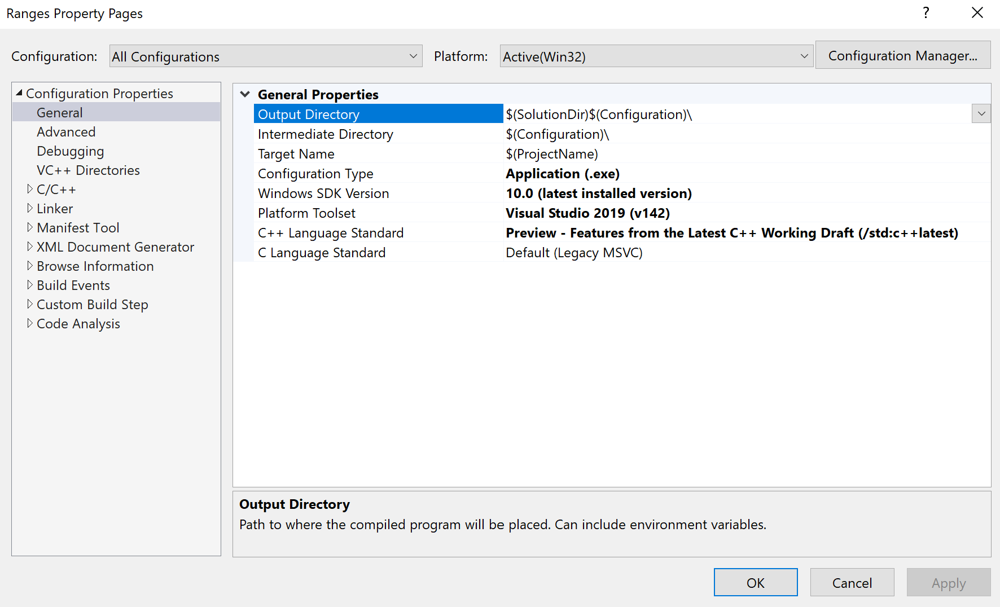

# C++&nbsp;20 / C++&nbsp;23 Spracherweiterungen

In diesem Repository werden einige der groflen Neuerungen von C++ 20 / C++ 23 n‰her betrachtet:
*Concepts*, *Ranges*, *Coroutinen*, eine neue Formatierung mit `std::format` und *Module*.

---

Die Beispiele aus dem Repository sind prinzipiell nur dann lauff‰hig, wenn man
in den Einstellung des ‹bersetzers (Microsoft Visual Studio: *Properties* Lasche,
dann weiter unter &ldquo;*General*&rdquo; und hier &ldquo;*C++ Language Standard*&rdquo;)
die Einstellung *Preview - Features from the Latest C++ Working Draft (/std:c++latest)* ausw‰hlt:

Abbildung 1: Projekteinstellungen unter Visual Studio 2022.

Alle vorgestellten Beispiele stellen nur Neuerungen von C++ vor,
die bereits fest in den C++ 20 Standard eingeflossen sind.

---

## [Coroutines](Programs/01_Coroutines/Readme.md)

## [Ranges](Programs/02_Ranges/Readme.md)

## [Concepts](Programs/03_Concepts/Readme.md)

## [Spaceship Operator `<=>`](Programs/06_SpaceshipOperator/Readme.md)

## [Modules](Programs/04_Modules/Readme.md)

---

## [Literatur](./Resources/Literature.md)

---
